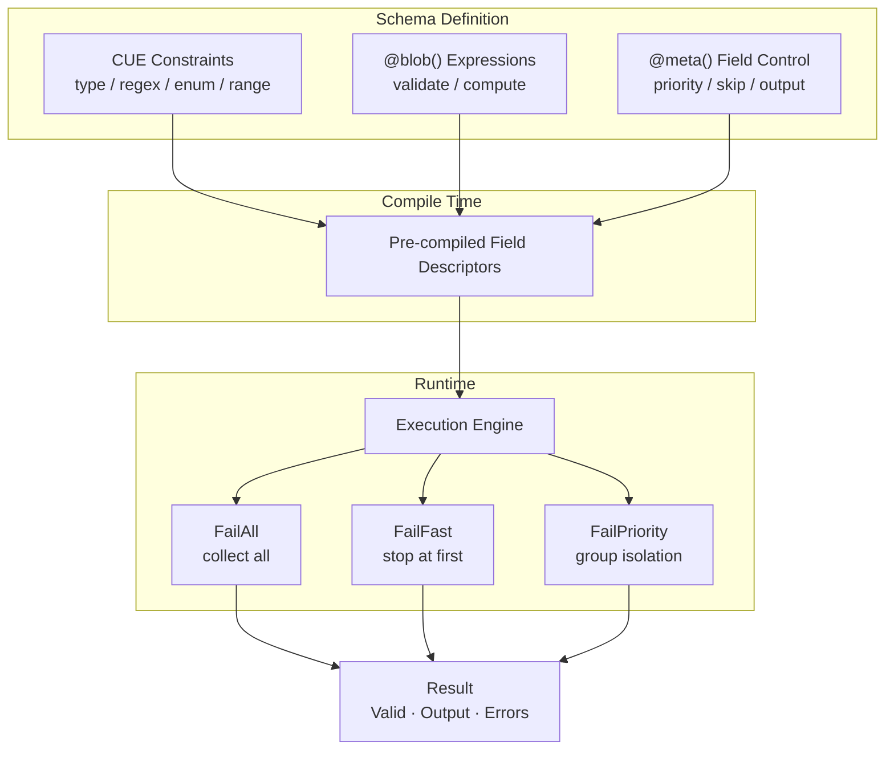

<div align="center">

# schemix

**Schema-driven validation & transformation engine**

CUE constraints + Bloblang dynamic expressions, unified.

[](https://pkg.go.dev/github.com/mredencom/schemix)
[](https://goreportcard.com/report/github.com/mredencom/schemix)
[](https://github.com/mredencom/schemix/actions/workflows/ci.yml)
[](LICENSE)

[English](README.md) | [中文](README_zh.md)

</div>

---



## Table of Contents

- [Features](#features)
- [Install](#install)
- [Quick Start](#quick-start)
- [API Validation](#api-validation)
- [Schema Syntax](#schema-syntax)
- [FailMode](#failmode)
- [Error Codes](#error-codes)
- [Bloblang Integration](#bloblang-integration)
- [Registry Management](#registry-management)
- [Convenience API](#convenience-api)
- [Benchmarks](#benchmarks)
- [License](#license)

## Features

| Category | Capabilities |
|----------|-------------|
| **Constraints** | Types, regex, enums, ranges, nested structs, arrays `[...{schema}]`, nullable `null \| type` |
| **Dynamic Rules** | Bloblang expressions — return `bool` for validation, other types for computed values |
| **Field Control** | Priority groups, conditional required/skip, omit empty, fail-fast per field |
| **Execution** | Three FailModes — collect all / stop at first / priority-group isolation |
| **Performance** | Pre-compiled field descriptors, skip @blob fields in CUE layer, Go-level fast checks |
| **Integration** | Method & function forms for Benthos/Redpanda Connect pipelines |
| **Management** | Thread-safe registry with Has/Unregister/List/Len, shared CUE context |
| **Error Handling** | Structured `E{layer}{category}{seq}` codes, `error` interface, path-based filtering |

## Install

```bash
go get github.com/mredencom/schemix@latest
```

> **Requires:** Go 1.22+

## Quick Start

```go
v, err := schemix.New(`{
    pan:      =~"^[0-9]{16}$"
    amount:   int & >0
    currency: "156" | "840"

    pan_check:  bool   @blob(this.pan.has_prefix("62") || this.pan.has_prefix("4"))
    card_brand: string @blob(if this.pan.has_prefix("62") { "UnionPay" } else { "Visa" })
    fee:        number @blob(if this.currency == "156" { 0 } else { (this.amount * 0.015).ceil() })
}`)

r := v.Process(map[string]any{
    "pan": "6222021234567890", "amount": int64(10000), "currency": "156",
})

r.Valid                // true
r.Output["card_brand"] // "UnionPay"
r.Output["fee"]        // 0
```

## API Validation

Pre-compile at startup, validate per request with zero compilation overhead:

```go
var userSchema = schemix.MustNew(`{
    username: =~"^[a-zA-Z][a-zA-Z0-9_]{2,20}$"
    email:    =~"^[a-zA-Z0-9._%+-]+@[a-zA-Z0-9.-]+\\.[a-zA-Z]{2,}$"
    password: =~"^.{8,64}$"
    role:     "admin" | "user" | "guest"
}`)

func CreateUser(w http.ResponseWriter, req *http.Request) {
    var body map[string]any
    json.NewDecoder(req.Body).Decode(&body)

    r := userSchema.ProcessWithMode(body, schemix.FailAll)
    if !r.Valid {
        w.WriteHeader(400)
        json.NewEncoder(w).Encode(map[string]any{
            "error":   "validation_failed",
            "details": r.Errors,
        })
        return
    }
    // use r.Output ...
}
```

## Schema Syntax

### CUE Constraints

| Syntax | Meaning | Example |
|--------|---------|---------|
| `string` / `int` / `float` / `bool` | Type constraint | `name: string` |
| `& >=N & <=M` | Range | `age: int & >=0 & <=150` |
| `=~"regex"` | Regex match | `pan: =~"^[0-9]{16}$"` |
| `"a" \| "b"` | Enum | `currency: "156" \| "840"` |
| `?` | Optional field | `memo?: string` |
| `null \| type` | Nullable | `memo: null \| string` |
| `{...}` | Nested struct | `address: { city: string }` |
| `[...{schema}]` | Array of schema | `items: [...{id: string}]` |

### @blob() — Bloblang Expressions

| Return Type | Behavior | Example |
|-------------|----------|---------|
| `bool = true` | Validation passes | `@blob(this.amount > 0)` |
| `bool = false` | Validation fails (→ E2B01) | `@blob(this.age >= 18)` |
| Non-bool | Computed value → Output | `@blob(this.first + " " + this.last)` |
| Comma-separated | AND — each independent | `@blob(expr1, expr2)` |

### @meta() — Field Behavior Control

| Parameter | Type | Meaning |
|-----------|------|---------|
| `priority=N` | int | Execution priority (lower = earlier) |
| `optional` | flag | No error if field missing |
| `conditional` | flag | Conditionally optional (with required_if) |
| `skip_empty` | flag | Skip validation when empty |
| `fail_fast` | flag | Skip remaining rules on failure |
| `omit_if_skip` | flag | Remove from Output when skipped |
| `omit_empty` | flag | Remove from Output when empty |
| `required_if=expr` | bloblang | Conditionally required |
| `skip_if=expr` | bloblang | Conditionally skip |

<details>
<summary><b>Combined Example</b></summary>

```cue
{
    payment_type: "credit" | "debit"
    cvv: string @meta(conditional, required_if=this.payment_type == "credit")

    pan: =~"^[0-9]{16}$" @meta(priority=1)
    luhn_check: bool @blob(this.pan.luhn_valid()) @meta(priority=2)

    memo?: string @meta(optional, omit_empty)
    fee?: number @meta(optional, skip_if=this.payment_type == "debit", omit_if_skip)
}
```

</details>

## FailMode

| Mode | Best For | Behavior |
|------|----------|----------|
| `FailAll` | Form validation | Collect all errors |
| `FailFast` | API gateway | Stop at first error |
| `FailPriority` | Layered validation | Priority-group isolation |

```go
r := v.ProcessWithMode(data, schemix.FailFast)  // 1 error max
r := v.ProcessWithMode(data, schemix.FailAll)   // all errors
r := v.ProcessWithMode(data, schemix.FailPriority) // p1 fails → skip p2+
```

## Error Codes

Format: `E{layer}{category}{seq}`

| Constant | Code | Layer | Meaning |
|----------|------|-------|---------|
| `CodeFormatMismatch` | E1F01 | CUE | Regex format mismatch |
| `CodeTypeMismatch` | E1T01 | CUE | Type error |
| `CodeEnumInvalid` | E1E01 | CUE | Invalid enum value |
| `CodeRangeViolation` | E1R01 | CUE | Range exceeded |
| `CodeRequiredMissing` | E1M01 | CUE | Required field missing |
| `CodeArrayElement` | E1A01 | CUE | Array element failed |
| `CodeCUEOther` | E1X01 | CUE | Other CUE error |
| `CodeBizRuleFailed` | E2B01 | Blob | Business rule false |
| `CodeExprExecError` | E2X01 | Blob | Expression error |
| `CodeCondRequired` | E3C01 | Meta | Conditional required |

## Bloblang Integration

```go
reg := schemix.NewRegistry()
reg.Register("payment", cueSrc)
reg.RegisterAll() // method + function forms
```

**Method form** — validates `this`:
```yaml
let r = this.process_schema(name: "payment", mode: "fast")
```

**Function form** — dynamic data source:
```yaml
let r = process_schema(data: this.payload, name: "payment")
```

## Registry Management

```go
reg := schemix.NewRegistry()       // shared CUE context internally
reg.Register("user", cueSrc)       // compile + store
reg.Has("user")                    // true
reg.List()                         // ["user"]
reg.Len()                          // 1
reg.Unregister("user")             // remove
```

## Convenience API

```go
// Construction
v := schemix.MustNew(cueSrc)              // panic on error
v, err := schemix.NewWithContext(ctx, src) // shared CUE context

// Result
r := v.Process(data)
r.Valid                         // bool
r.Output                        // map with computed fields
r.Err()                         // error (nil if valid)
r.FirstError()                  // *ValidationError
r.ErrorsByPath("pan")           // []ValidationError
r.ErrorMessages()               // newline-joined string
```

## Benchmarks

Apple M4, Go 1.25 — 6 fields (3 CUE + 3 @blob):

| Operation | Time | Memory | Allocs |
|-----------|------|--------|--------|
| `New` (compile) | 393 µs | 777 KB | 21894 |
| `Process` (valid) | **16 µs** | 41 KB | 308 |
| `Process` (invalid) | 26 µs | 50 KB | 525 |
| `Process` (nested) | 38 µs | 68 KB | 671 |
| `Registry.Get` | 5.6 ns | 0 B | 0 |

## License

[MIT](LICENSE)
