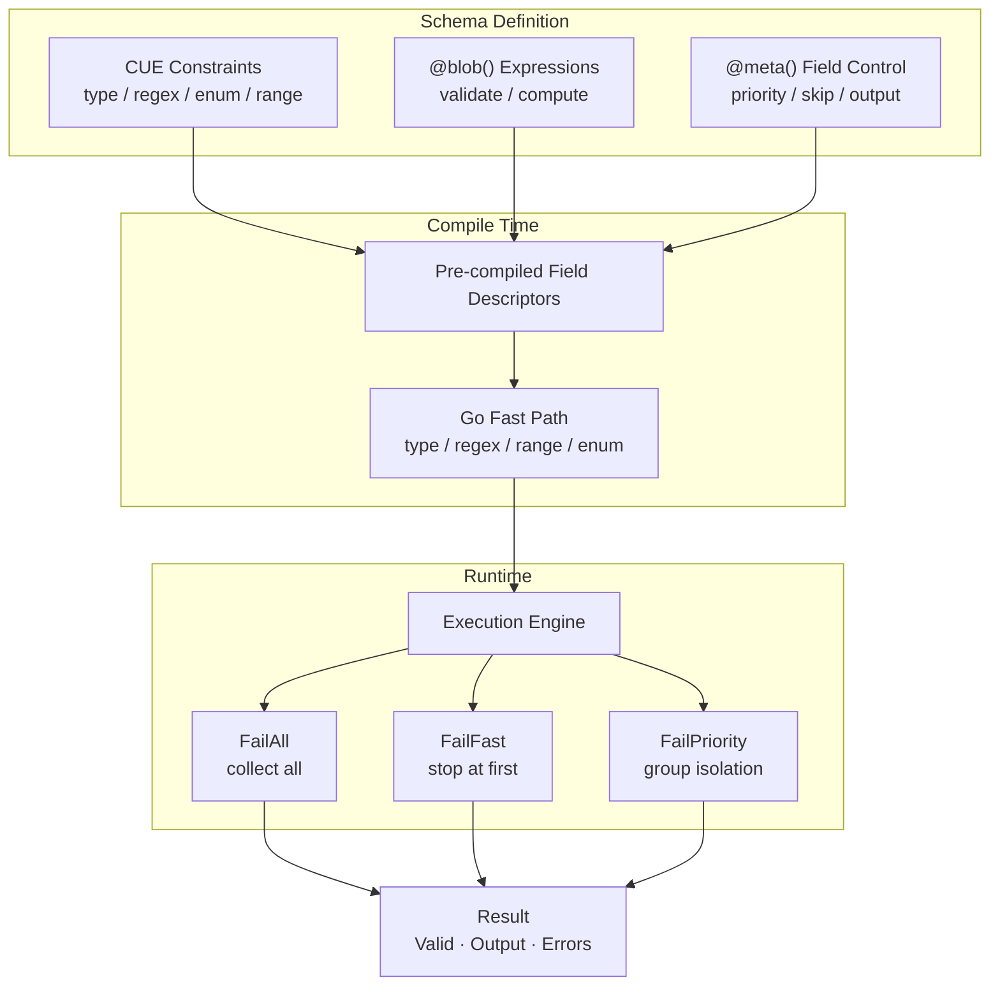

<div align="center">

# schemix

**Schema-driven validation & transformation engine**

CUE constraints + Bloblang dynamic expressions, unified.

[](https://pkg.go.dev/github.com/mredencom/schemix)
[](https://goreportcard.com/report/github.com/mredencom/schemix)
[](https://github.com/mredencom/schemix/actions/workflows/ci.yml)
[](LICENSE)

[English](README.md) | [中文](README_zh.md)

</div>

---



## Table of Contents

- [Features](#features)
- [Install](#install)
- [Quick Start](#quick-start)
- [Built-in Validators](#built-in-validators)
- [API Validation](#api-validation)
- [Schema Syntax](#schema-syntax)
- [Custom Functions & Methods](#custom-functions--methods)
- [Error Handling](#error-handling)
- [Custom Error Messages](#custom-error-messages)
- [Schema Composition](#schema-composition)
- [Schema Introspection](#schema-introspection)
- [FailMode](#failmode)
- [Error Codes](#error-codes)
- [Bloblang Integration](#bloblang-integration)
- [Registry Management](#registry-management)
- [Convenience API](#convenience-api)
- [Benchmarks](#benchmarks)
- [License](#license)

## Features

| Category | Capabilities |
|----------|-------------|
| **Constraints** | Types, regex, enums, ranges, nested structs, arrays `[...{schema}]`, nullable `null \| type` |
| **Dynamic Rules** | Bloblang expressions — return `bool` for validation, other types for computed values |
| **Built-in Validators** | 37+ methods: email, URL, UUID, IP, Luhn, JSON, Base64, mobile, length, range... |
| **Custom Functions** | Register your own functions/methods with Bloblang-compatible API (V1 & V2 styles) |
| **Field Control** | Priority groups, conditional required/skip, omit empty, fail-fast per field |
| **Execution** | Three FailModes — collect all / stop at first / priority-group isolation |
| **Performance** | Go-native fast path for scalar fields (2.5µs/op), pre-compiled descriptors |
| **Error Handling** | Structured codes, chain API (HasCode/ErrorsByCode/ErrorsByType), custom i18n formatter |
| **Composition** | Schema reuse via CUE definitions + `NewFromValue`, runtime introspection |
| **Integration** | Method & function forms for Benthos/Redpanda Connect pipelines |
| **Thread Safety** | Validator immutable after construction; Registry uses RWMutex |

## Install

```bash
go get github.com/mredencom/schemix@latest
```

> **Requires:** Go 1.22+

## Quick Start

```go
v, err := schemix.New(`{
    pan:      =~"^[0-9]{16}$"
    amount:   int & >0
    currency: "156" | "840"

    // Built-in validators
    luhn:       bool   @blob(this.pan.luhn_valid())
    pan_check:  bool   @blob(this.pan.has_prefix("62") || this.pan.has_prefix("4"))

    // Computed fields
    card_brand: string @blob(if this.pan.has_prefix("62") { "UnionPay" } else { "Visa" })
    fee:        number @blob(if this.currency == "156" { 0 } else { (this.amount * 0.015).ceil() })
}`)

r := v.Process(map[string]any{
    "pan": "4111111111111111", "amount": int64(10000), "currency": "840",
})

r.Valid                // true
r.Output["card_brand"] // "Visa"
r.Output["fee"]        // 150
```

## Built-in Validators

All methods are available automatically in `@blob()` expressions — no registration needed.

### String Format

| Method | Usage | Description |
|--------|-------|-------------|
| `is_email()` | `this.email.is_email()` | Email address format |
| `is_url()` | `this.link.is_url()` | URL with scheme |
| `is_full_url()` | `this.cb.is_full_url()` | Must start with http/https |
| `is_uuid()` | `this.id.is_uuid()` | UUID any version |
| `is_uuid3/4/5()` | `this.id.is_uuid4()` | Specific UUID version |
| `is_ip()` | `this.host.is_ip()` | IPv4 or IPv6 |
| `is_ipv4()` / `is_ipv6()` | `this.ip.is_ipv4()` | Specific IP version |
| `is_cidr()` | `this.net.is_cidr()` | CIDR notation |
| `is_mac()` | `this.mac.is_mac()` | MAC address |
| `is_dns_name()` | `this.host.is_dns_name()` | DNS hostname |
| `is_json()` | `this.body.is_json()` | Valid JSON string |
| `is_base64()` | `this.token.is_base64()` | Base64 encoded |
| `is_hex()` | `this.hash.is_hex()` | Hexadecimal string |
| `is_hex_color()` | `this.color.is_hex_color()` | #RGB or #RRGGBB |
| `is_rgb_color()` | `this.color.is_rgb_color()` | rgb(r,g,b) |
| `is_data_uri()` | `this.img.is_data_uri()` | data:mime;base64,... |
| `is_latitude()` | `this.lat.is_latitude()` | -90 to 90 |
| `is_longitude()` | `this.lng.is_longitude()` | -180 to 180 |
| `is_isbn10/13()` | `this.isbn.is_isbn13()` | ISBN format |
| `is_cn_mobile()` | `this.phone.is_cn_mobile()` | China mobile (1xx) |

### Character Type

| Method | Usage | Description |
|--------|-------|-------------|
| `is_alpha()` | `this.name.is_alpha()` | Letters only |
| `is_alpha_num()` | `this.code.is_alpha_num()` | Letters + digits |
| `is_alpha_dash()` | `this.slug.is_alpha_dash()` | Letters + digits + `-_` |
| `is_numeric()` | `this.pin.is_numeric()` | Digits only (0-9) |
| `is_number()` | `this.val.is_number()` | Number string (±, decimal) |
| `is_ascii()` | `this.s.is_ascii()` | ASCII only |
| `is_printable_ascii()` | `this.s.is_printable_ascii()` | Printable ASCII (32-126) |
| `is_multibyte()` | `this.s.is_multibyte()` | Contains multibyte chars |

### String Checks

| Method | Usage | Description |
|--------|-------|-------------|
| `not_blank()` | `this.name.not_blank()` | Not empty/whitespace |
| `has_whitespace()` | `this.s.has_whitespace()` | Contains whitespace |

### Length & Range

| Method | Usage | Description |
|--------|-------|-------------|
| `len_between(min,max)` | `this.s.len_between(min:3, max:20)` | String/slice/map length |
| `min_len(n)` | `this.s.min_len(n: 3)` | Minimum length |
| `max_len(n)` | `this.s.max_len(n: 100)` | Maximum length |
| `str_len(min,max)` | `this.s.str_len(min:2, max:10)` | Rune count range |
| `between(min,max)` | `this.age.between(min:0, max:150)` | Numeric range (inclusive) |

### Financial

| Method | Usage | Description |
|--------|-------|-------------|
| `luhn_valid()` | `this.pan.luhn_valid()` | Luhn checksum (card numbers) |

### Date Functions

| Function | Usage | Description |
|----------|-------|-------------|
| `is_valid_date(d)` | `is_valid_date(this.date)` | Parseable date string |
| `is_past_date(d)` | `is_past_date(this.birthday)` | Date is in the past |
| `is_future_date(d)` | `is_future_date(this.expiry)` | Date is in the future |

## API Validation

Pre-compile at startup, validate per request with zero compilation overhead:

```go
var userSchema = schemix.MustNew(`{
    username: =~"^[a-zA-Z][a-zA-Z0-9_]{2,20}$"
    email:    string @blob(this.email.is_email())
    password: string @blob(this.password.len_between(min: 8, max: 64))
    age:      int    @blob(this.age.between(min: 13, max: 150))
    role:     "admin" | "user" | "guest"
}`, schemix.WithErrorFormatter(apiFormatter))

func CreateUser(w http.ResponseWriter, req *http.Request) {
    var body map[string]any
    json.NewDecoder(req.Body).Decode(&body)

    r := userSchema.ProcessWithMode(body, schemix.FailAll)
    if !r.Valid {
        status := http.StatusBadRequest
        if r.HasCode(schemix.CodeRequiredMissing) {
            status = http.StatusUnprocessableEntity
        }
        w.WriteHeader(status)
        json.NewEncoder(w).Encode(map[string]any{
            "error":   "validation_failed",
            "details": r.Errors,
        })
        return
    }
    // use r.Output ...
}
```

## Schema Syntax

### CUE Constraints

| Syntax | Meaning | Example |
|--------|---------|---------|
| `string` / `int` / `float` / `bool` | Type constraint | `name: string` |
| `& >=N & <=M` | Range | `age: int & >=0 & <=150` |
| `=~"regex"` | Regex match | `pan: =~"^[0-9]{16}$"` |
| `"a" \| "b"` | Enum | `currency: "156" \| "840"` |
| `?` | Optional field | `memo?: string` |
| `null \| type` | Nullable | `memo: null \| string` |
| `{...}` | Nested struct | `address: { city: string }` |
| `[...{schema}]` | Array of schema | `items: [...{id: string}]` |

### @blob() — Bloblang Expressions

| Return Type | Behavior | Example |
|-------------|----------|---------|
| `bool = true` | Validation passes | `@blob(this.amount > 0)` |
| `bool = false` | Validation fails (→ E2B01) | `@blob(this.age >= 18)` |
| Non-bool | Computed value → Output | `@blob(this.first + " " + this.last)` |
| Comma-separated | AND — each independent | `@blob(expr1, expr2)` |

### @meta() — Field Behavior Control

| Parameter | Type | Meaning |
|-----------|------|---------|
| `priority=N` | int | Execution priority (lower = earlier) |
| `optional` | flag | No error if field missing |
| `conditional` | flag | Conditionally optional (with required_if) |
| `skip_empty` | flag | Skip validation when empty |
| `fail_fast` | flag | Skip remaining rules on failure |
| `omit_if_skip` | flag | Remove from Output when skipped |
| `omit_empty` | flag | Remove from Output when empty |
| `required_if=expr` | bloblang | Conditionally required |
| `skip_if=expr` | bloblang | Conditionally skip |

<details>
<summary><b>Combined Example</b></summary>

```cue
{
    payment_type: "credit" | "debit"
    cvv: string @meta(conditional, required_if=this.payment_type == "credit")

    pan: =~"^[0-9]{16}$" @meta(priority=1)
    luhn_check: bool @blob(this.pan.luhn_valid()) @meta(priority=2)

    memo?: string @meta(optional, omit_empty)
    fee?: number @meta(optional, skip_if=this.payment_type == "debit", omit_if_skip)
}
```

</details>

## Custom Functions & Methods

Register custom validation logic using the same API as Bloblang — isolated per Validator:

```go
// Function style: my_func(args...)
v, _ := schemix.New(schema, schemix.WithFunction("check_blacklist",
    func(args ...any) (bloblang.Function, error) {
        pan := args[0].(string)
        return func() (any, error) {
            return !isBlocked(pan), nil
        }, nil
    },
))

// Method style: this.field.my_method()
v, _ := schemix.New(schema, schemix.WithMethod("is_valid_bin",
    func(v any) (any, error) {
        return checkBIN(v.(string)), nil
    },
))

// V2 style with typed parameters (PluginSpec + ParsedParams)
v, _ := schemix.New(schema, schemix.WithFunctionV2("calc_fee",
    bloblang.NewPluginSpec().
        Param(bloblang.NewInt64Param("amount")).
        Param(bloblang.NewFloat64Param("rate")),
    func(args *bloblang.ParsedParams) (bloblang.Function, error) {
        amount, _ := args.GetInt64("amount")
        rate, _ := args.GetFloat64("rate")
        return func() (any, error) { return float64(amount) * rate, nil }, nil
    },
))

// V2 method with params: this.field.method(param: value)
v, _ := schemix.New(schema, schemix.WithMethodV2("in_range",
    bloblang.NewPluginSpec().
        Param(bloblang.NewInt64Param("min")).
        Param(bloblang.NewInt64Param("max")),
    func(args *bloblang.ParsedParams) (bloblang.Method, error) {
        min, _ := args.GetInt64("min")
        max, _ := args.GetInt64("max")
        return func(v any) (any, error) {
            n := v.(int64)
            return n >= min && n <= max, nil
        }, nil
    },
))
```

### FuncMap (Reusable Collections)

For multiple custom functions, use `FuncMap` to build once and share:

```go
funcs := schemix.NewFuncMap(
    schemix.Func("check_blacklist", blacklistFn),
    schemix.Func("calc_fee", feeFn),
    schemix.Method("mask_pan", maskFn),
    schemix.MethodV2("in_range", rangeSpec, rangeCtor),
)

// Share across validators
v1, _ := schemix.New(schema1, schemix.WithFuncMap(funcs))
v2, _ := schemix.New(schema2, schemix.WithFuncMap(funcs))
```

Names are validated at construction time (must be snake_case: `/^[a-z0-9]+(_[a-z0-9]+)*$/`).

### Overriding Built-in Validators

Built-in names are protected by default. Use `WithOverrideMethod` or `WithOverrideFunc` to
explicitly replace them:

```go
// Override a specific built-in method
v, _ := schemix.New(schema,
    schemix.WithOverrideMethod("is_email"),
    schemix.WithMethod("is_email", myStrictEmailFn),
)

// Override a specific built-in function
v, _ := schemix.New(schema,
    schemix.WithOverrideFunc("is_valid_date"),
    schemix.WithFunction("is_valid_date", myDateFn),
)

// Override all — disable conflict checks entirely
v, _ := schemix.New(schema, schemix.WithOverrideAll(), schemix.WithFuncMap(myFuncs))
```

> Note: Function and Method are separate namespaces. Registering a **Function** named
> `is_email` does NOT conflict with the built-in **Method** `is_email`.

## Error Handling

```go
r := v.Process(data)

r.Valid                              // bool
r.Err()                              // combined error (nil if valid)
r.FirstError()                       // *ValidationError
r.ErrorsByPath("pan")                // []ValidationError
r.ErrorsByCode(schemix.CodeTypeMismatch) // []ValidationError
r.ErrorsByType("cue")                // []ValidationError — filter by layer
r.HasCode(schemix.CodeBizRuleFailed) // bool — quick category check
r.HasErrorsAt("email")              // bool — field-level check
r.ErrorMessages()                    // newline-joined string
```

## Custom Error Messages

Provide a custom `ErrorFormatter` for i18n or user-facing messages:

```go
v := schemix.MustNew(schema, schemix.WithErrorFormatter(
    func(code schemix.ErrorCode, path, detail string) string {
        return i18n.T("zh-CN", string(code), path)
    },
))
```

The formatter receives the error code, field path, and default detail message.
Return your desired user-facing string. Default behavior (no formatter) passes
the raw CUE/Bloblang error message through.

## Schema Composition

Use `NewFromValue` to build validators from pre-compiled CUE values with shared definitions:

```go
ctx := cuecontext.New()
schema := ctx.CompileString(`{
    #PAN:      =~"^[0-9]{16}$"
    #Amount:   int & >0
    #Currency: "CNY" | "USD" | "EUR"

    pan:      #PAN
    amount:   #Amount
    currency: #Currency
}`)

v, err := schemix.NewFromValue(schema)
```

## Schema Introspection

Inspect schema structure at runtime for documentation or UI generation:

```go
fields := v.Fields() // []FieldInfo

for _, f := range fields {
    fmt.Printf("%s: %s (optional=%v, blob=%v)\n", f.Path, f.Type, f.Optional, f.HasBlob)
    for _, child := range f.Children {
        fmt.Printf("  %s: %s\n", child.Path, child.Type)
    }
}
```

## FailMode

| Mode | Best For | Behavior |
|------|----------|----------|
| `FailAll` | Form validation | Collect all errors |
| `FailFast` | API gateway | Stop at first error |
| `FailPriority` | Layered validation | Priority-group isolation |

```go
r := v.ProcessWithMode(data, schemix.FailFast)     // 1 error max
r := v.ProcessWithMode(data, schemix.FailAll)      // all errors
r := v.ProcessWithMode(data, schemix.FailPriority) // p1 fails → skip p2+
```

## Error Codes

Format: `E{layer}{category}{seq}`

| Constant | Code | Layer | Meaning |
|----------|------|-------|---------|
| `CodeFormatMismatch` | E1F01 | CUE | Regex format mismatch |
| `CodeTypeMismatch` | E1T01 | CUE | Type error |
| `CodeEnumInvalid` | E1E01 | CUE | Invalid enum value |
| `CodeRangeViolation` | E1R01 | CUE | Range exceeded |
| `CodeRequiredMissing` | E1M01 | CUE | Required field missing |
| `CodeArrayElement` | E1A01 | CUE | Array element failed |
| `CodeCUEOther` | E1X01 | CUE | Other CUE error |
| `CodeBizRuleFailed` | E2B01 | Blob | Business rule false |
| `CodeExprExecError` | E2X01 | Blob | Expression error |
| `CodeCondRequired` | E3C01 | Meta | Conditional required |

## Bloblang Integration

```go
reg := schemix.NewRegistry()
reg.Register("payment", cueSrc)
reg.RegisterAll() // method + function forms
```

**Method form** — validates `this`:
```yaml
let r = this.process_schema(name: "payment", mode: "fast")
```

**Function form** — dynamic data source:
```yaml
let r = process_schema(data: this.payload, name: "payment")
```

## Registry Management

```go
reg := schemix.NewRegistry()       // shared CUE context internally
reg.Register("user", cueSrc)       // compile + store
reg.Has("user")                    // true
reg.List()                         // ["user"]
reg.Len()                          // 1
reg.Unregister("user")             // remove
```

## Convenience API

```go
// Construction
v := schemix.MustNew(cueSrc)                    // panic on error
v, _ := schemix.NewWithContext(ctx, src)         // shared CUE context
v, _ := schemix.NewFromValue(cueValue)           // from pre-compiled CUE value

// Options
schemix.WithErrorFormatter(fn)                   // custom error messages
schemix.WithFunction(name, ctor)                 // custom function (V1)
schemix.WithFunctionV2(name, spec, ctor)         // custom function (V2)
schemix.WithMethod(name, fn)                     // custom method (V1)
schemix.WithMethodV2(name, spec, ctor)           // custom method (V2)

// Validation (fast path — no Output allocation)
valid, errs := v.Validate(data)

// Processing (validation + computed fields)
r := v.Process(data)
r := v.ProcessWithMode(data, schemix.FailFast)

// Introspection
fields := v.Fields()                             // []FieldInfo
```

## Benchmarks

Apple M4, Go 1.25 — 6 fields (3 CUE + 3 @blob):

| Operation | Time | Memory | Allocs |
|-----------|------|--------|--------|
| `New` (compile) | 430 µs | 808 KB | 22195 |
| `Process` (valid) | **2.5 µs** | 4.0 KB | 61 |
| `Process` (invalid) | 2.9 µs | 4.7 KB | 75 |
| `Process` (nested) | 28 µs | 40 KB | 456 |
| `Validate` (no output) | 2.4 µs | 3.6 KB | 57 |
| `Registry.Get` | 5.6 ns | 0 B | 0 |

> Simple scalar fields use a Go-native fast path that bypasses CUE entirely,
> achieving **127x speedup** over the CUE Unify path (115ns vs 14.6µs for validation only).

## License

[MIT](LICENSE)
