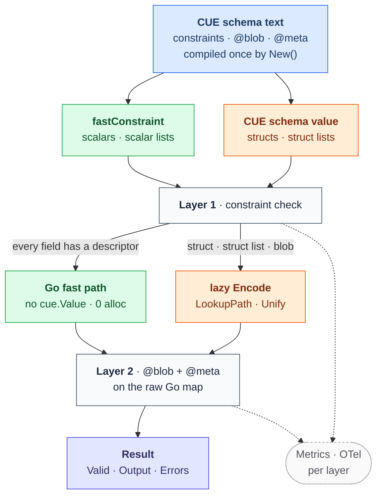

<div align="center">

# Schemix

**Schema Mix** | /skiːmɪks/

**Schema-driven validation & transformation engine**

CUE constraints + Bloblang dynamic expressions, unified.

[](https://pkg.go.dev/github.com/mredencom/schemix)
[](https://github.com/mredencom/schemix/blob/main/go.mod)
[](https://github.com/mredencom/schemix/releases)
[](https://codecov.io/gh/mredencom/schemix)
[](https://github.com/mredencom/schemix/actions/workflows/ci.yml)
[](LICENSE)

[English](README.md) | [中文](README_zh.md)

</div>

---


```mermaid
%%{init: {'flowchart': {'wrappingWidth': 340, 'curve': 'basis', 'nodeSpacing': 45, 'rankSpacing': 48}}}%%
graph TD
    SRC["<b>CUE schema text</b><br/>constraints · @blob · @meta<br/>compiled once by New()"]:::schema

    SRC --> FAST["<b>fastConstraint</b><br/>scalars · scalar lists"]:::fast
    SRC --> CV["<b>CUE schema value</b><br/>structs · struct lists"]:::slow

    FAST --> L1["<b>Layer 1</b> · constraint check"]:::layer
    CV --> L1

    L1 -->|every field has a descriptor| Z["<b>Go fast path</b><br/>no cue.Value · 0 alloc"]:::fast
    L1 -->|struct · struct list · blob| E["<b>lazy Encode</b><br/>LookupPath · Unify"]:::slow

    Z --> L2["<b>Layer 2</b> · @blob + @meta<br/>on the raw Go map"]:::layer
    E --> L2

    L2 --> R["<b>Result</b><br/>Valid · Output · Errors"]:::result
    L1 -.-> OBS(["Metrics · OTel<br/>per layer"]):::obs
    L2 -.-> OBS

    classDef schema fill:#dbeafe,stroke:#2563eb,color:#1e3a5f
    classDef fast fill:#dcfce7,stroke:#16a34a,color:#14532d
    classDef slow fill:#ffedd5,stroke:#ea580c,color:#7c2d12
    classDef layer fill:#f8fafc,stroke:#475569,color:#1e293b
    classDef result fill:#e0e7ff,stroke:#4f46e5,color:#312e5f
    classDef obs fill:#fafafa,stroke:#a1a1aa,stroke-dasharray:3 3,color:#52525b
```

> Green is the allocation-free path; orange is where the input must become a
> `cue.Value`.

## Table of Contents

- [Schemix](#schemix)
  - [Table of Contents](#table-of-contents)
  - [Features](#features)
  - [Install](#install)
  - [Quick Start](#quick-start)
  - [Built-in Validators](#built-in-validators)
    - [String Format](#string-format)
    - [Character Type](#character-type)
    - [String Checks](#string-checks)
    - [Length \& Range](#length--range)
    - [Financial](#financial)
    - [Date Functions](#date-functions)
    - [Comparison Functions](#comparison-functions)
  - [API Validation](#api-validation)
  - [Schema Syntax](#schema-syntax)
    - [CUE Constraints](#cue-constraints)
    - [@blob() — Bloblang Expressions](#blob--bloblang-expressions)
    - [@meta() — Field Behavior Control](#meta--field-behavior-control)
    - [Arrays](#arrays)
  - [Custom Functions \& Methods](#custom-functions--methods)
    - [FuncMap (Reusable Collections)](#funcmap-reusable-collections)
    - [Overriding Built-in Validators](#overriding-built-in-validators)
  - [Error Handling](#error-handling)
  - [Localization](#localization)
    - [Overriding messages](#overriding-messages)
    - [Using an existing i18n pipeline](#using-an-existing-i18n-pipeline)
    - [Two things it does not change](#two-things-it-does-not-change)
  - [Custom Error Messages](#custom-error-messages)
  - [Schema Composition](#schema-composition)
  - [Schema Introspection](#schema-introspection)
  - [FailMode](#failmode)
  - [Error Codes](#error-codes)
  - [Bloblang Integration](#bloblang-integration)
  - [Registry Management](#registry-management)
  - [Observability](#observability)
    - [Metrics](#metrics)
    - [Ready-made recorders](#ready-made-recorders)
    - [Tracing](#tracing)
  - [Convenience API](#convenience-api)
  - [Benchmarks](#benchmarks)
  - [Comparison](#comparison)
  - [License](#license)

## Features

| Category | Capabilities |
|----------|-------------|
| **Constraints** | Types, regex, enums, ranges, nested structs, arrays `[...{schema}]`, nullable `null \| type` |
| **Dynamic Rules** | Bloblang expressions — return `bool` for validation, other types for computed values |
| **Built-in Validators** | 37+ methods: email, URL, UUID, IP, Luhn, JSON, Base64, mobile, length, range... |
| **Custom Functions** | Register your own functions/methods with Bloblang-compatible API (V1 & V2 styles) |
| **Field Control** | Priority groups, conditional required/skip, omit empty, fail-fast per field |
| **Execution** | Three FailModes — collect all / stop at first / priority-group isolation |
| **Performance** | Pre-compiled descriptors; scalar-only schemas validate in **382 ns with zero allocations** — `cue.Context.Encode` is skipped entirely |
| **Observability** | `MetricsRecorder` hooks + OpenTelemetry tracing; ready-made `schemixprom` / `schemixotel` recorders |
| **Error Handling** | Structured codes, chain API (HasCode/ErrorsByCode/ErrorsByType) |
| **Localization** | `Localizer` interface + built-in `EnUS` / `ZhCN` catalogs; per-request language selection |
| **Composition** | Schema reuse via CUE definitions + `NewFromValue`, runtime introspection |
| **Integration** | Method & function forms for Benthos/Redpanda Connect pipelines |
| **Thread Safety** | Validator immutable after construction; Registry uses RWMutex |

## Install

```bash
go get github.com/mredencom/schemix@latest
```

> **Requires:** Go 1.25.0 or newer

## Quick Start

```go
v, err := schemix.New(`{
    pan:      =~"^[0-9]{16}$"
    amount:   int & >0
    currency: "156" | "840"

    // Built-in validators
    luhn:       bool   @blob(this.pan.luhn_valid())
    pan_check:  bool   @blob(this.pan.has_prefix("62") || this.pan.has_prefix("4"))

    // Computed fields
    card_brand: string @blob(if this.pan.has_prefix("62") { "UnionPay" } else { "Visa" })
    fee:        number @blob(if this.currency == "156" { 0 } else { (this.amount * 0.015).ceil() })
}`)

r := v.Process(map[string]any{
    "pan": "4111111111111111", "amount": int64(10000), "currency": "840",
})

r.Valid                // true
r.Output["card_brand"] // "Visa"
r.Output["fee"]        // 150
```

## Built-in Validators

All methods are available automatically in `@blob()` expressions — no registration needed.

### String Format

| Method | Usage | Description |
|--------|-------|-------------|
| `is_email()` | `this.email.is_email()` | Email address format |
| `is_url()` | `this.link.is_url()` | URL with scheme |
| `is_full_url()` | `this.cb.is_full_url()` | Must start with http/https |
| `is_uuid()` | `this.id.is_uuid()` | UUID any version |
| `is_uuid3/4/5()` | `this.id.is_uuid4()` | Specific UUID version |
| `is_ip()` | `this.host.is_ip()` | IPv4 or IPv6 |
| `is_ipv4()` / `is_ipv6()` | `this.ip.is_ipv4()` | Specific IP version |
| `is_cidr()` | `this.net.is_cidr()` | CIDR notation |
| `is_mac()` | `this.mac.is_mac()` | MAC address |
| `is_dns_name()` | `this.host.is_dns_name()` | DNS hostname |
| `is_json()` | `this.body.is_json()` | Valid JSON string |
| `is_base64()` | `this.token.is_base64()` | Base64 encoded |
| `is_hex()` | `this.hash.is_hex()` | Hexadecimal string |
| `is_hex_color()` | `this.color.is_hex_color()` | #RGB or #RRGGBB |
| `is_rgb_color()` | `this.color.is_rgb_color()` | rgb(r,g,b) |
| `is_data_uri()` | `this.img.is_data_uri()` | data:mime;base64,... |
| `is_latitude()` | `this.lat.is_latitude()` | -90 to 90 |
| `is_longitude()` | `this.lng.is_longitude()` | -180 to 180 |
| `is_isbn10/13()` | `this.isbn.is_isbn13()` | ISBN format |
| `is_cn_mobile()` | `this.phone.is_cn_mobile()` | China mobile (1xx) |

### Character Type

| Method | Usage | Description |
|--------|-------|-------------|
| `is_alpha()` | `this.name.is_alpha()` | Letters only |
| `is_alpha_num()` | `this.code.is_alpha_num()` | Letters + digits |
| `is_alpha_dash()` | `this.slug.is_alpha_dash()` | Letters + digits + `-_` |
| `is_numeric()` | `this.pin.is_numeric()` | Digits only (0-9) |
| `is_number()` | `this.val.is_number()` | Number string (±, decimal) |
| `is_ascii()` | `this.s.is_ascii()` | ASCII only |
| `is_printable_ascii()` | `this.s.is_printable_ascii()` | Printable ASCII (32-126) |
| `is_multibyte()` | `this.s.is_multibyte()` | Contains multibyte chars |

### String Checks

| Method | Usage | Description |
|--------|-------|-------------|
| `not_blank()` | `this.name.not_blank()` | Not empty/whitespace |
| `has_whitespace()` | `this.s.has_whitespace()` | Contains whitespace |

### Length & Range

| Method | Usage | Description |
|--------|-------|-------------|
| `len_between(min,max)` | `this.s.len_between(min:3, max:20)` | Byte length of a string; element count of a slice/map |
| `min_len(n)` | `this.s.min_len(n: 3)` | Minimum, same units as `len_between` |
| `max_len(n)` | `this.s.max_len(n: 100)` | Maximum, same units as `len_between` |
| `str_len(min,max)` | `this.s.str_len(min:2, max:10)` | Rune count range |
| `between(min,max)` | `this.age.between(min:0, max:150)` | Numeric range (inclusive) |

> **For a user-facing length limit, reach for `str_len`.** The three `*_len`
> methods count bytes on a string, so `password.len_between(min: 8, max: 64)`
> accepts three CJK characters — nine bytes. `str_len` counts runes.

### Financial

| Method | Usage | Description |
|--------|-------|-------------|
| `luhn_valid()` | `this.pan.luhn_valid()` | Luhn checksum (card numbers) |

### Date Functions

| Function | Usage | Description |
|----------|-------|-------------|
| `is_valid_date(d)` | `is_valid_date(this.date)` | Parseable date string |
| `is_past_date(d)` | `is_past_date(this.birthday)` | Date is in the past |
| `is_future_date(d)` | `is_future_date(this.expiry)` | Date is in the future |

### Comparison Functions

| Function | Usage | Description |
|----------|-------|-------------|
| `in_list(value, candidates)` | `in_list(this.status, ["active","pending"])` | Returns true if value is in the list |

## API Validation

Pre-compile at startup, validate per request with zero compilation overhead:

```go
var userSchema = schemix.MustNew(`{
    // Anything CUE can express belongs in CUE: these stay on the Go-native
    // fast path, and a violation carries a precise code and the bound it broke.
    username: =~"^[a-zA-Z][a-zA-Z0-9_]{2,20}$"
    age:      int & >=13 & <=150
    role:     "admin" | "user" | "guest"

    // A rule is for what CUE cannot express. str_len counts runes; len_between
    // counts bytes, which would let three CJK characters pass as eight.
    email:    string @blob(this.email.is_email())
    password: string @blob(this.password.str_len(min: 8, max: 64))
}`)

func CreateUser(w http.ResponseWriter, req *http.Request) {
    raw, err := io.ReadAll(req.Body)
    if err != nil {
        respond(w, http.StatusBadRequest, map[string]any{"error": "unreadable_body"})
        return
    }

    // Hand ProcessValue the raw bytes so a JSON number reaches an `int` field as
    // an integer. Decoding into map[string]any first makes every number a
    // float64, and CUE's `int` rejects a float — see the note below.
    r := userSchema.ProcessValue(raw) // FailAll: collects every error
    if !r.Valid {
        // A body that is not JSON at all fails at the conversion layer. That is
        // a different problem from a field that broke a rule, and deserves 400.
        if r.HasCode(schemix.CodeConfigError) {
            respond(w, http.StatusBadRequest, map[string]any{"error": "malformed_json"})
            return
        }

        // Localize per request rather than per validator, so one compiled
        // schema serves every language. e.Message holds raw CUE/Bloblang
        // wording — log it, don't return it.
        loc := catalogFor(req.Header.Get("Accept-Language"))
        details := make([]map[string]string, len(r.Errors))
        for i, e := range r.Errors {
            details[i] = map[string]string{
                "field":   e.Path,
                "code":    string(e.Code),
                "message": loc.Localize(e),
            }
        }
        respond(w, http.StatusUnprocessableEntity, map[string]any{
            "error":   "validation_failed",
            "details": details,
        })
        return
    }

    respond(w, http.StatusCreated, saveUser(r.Output)) // computed fields included
}

// respond writes JSON. Content-Type must be set *before* WriteHeader; a header
// set afterwards is silently discarded.
func respond(w http.ResponseWriter, status int, body any) {
    w.Header().Set("Content-Type", "application/json")
    w.WriteHeader(status)
    _ = json.NewEncoder(w).Encode(body)
}

// catalogFor maps a request to a language. Returning the interface rather than
// *schemix.Catalog is what lets you swap in your own i18n pipeline later without
// touching the handler.
func catalogFor(header string) schemix.Localizer {
    if strings.HasPrefix(header, "zh") {
        return schemix.ZhCN
    }
    return schemix.EnUS
}
```

A body that could not be parsed is a `400`; a well-formed body whose contents
break the schema is a `422`. `HasCode` separates the two.

> **Give `ProcessValue` the bytes, not a decoded map.** `json.Unmarshal` turns
> every JSON number into a `float64`, and CUE keeps `int` and `float` as sibling
> types, so `age: int & >=13 & <=150` rejects a decoded `28` with `E1T01`.
> `ProcessValue` converts JSON numbers to integers where the value allows it.
> (`json.Decoder.UseNumber()` does not help — a `json.Number` is a string.)

> **Prefer CUE over `@blob` for anything CUE can state.** `age: int & >=13 & <=150`
> fails with `E1R01` and `age must be <=150`; the same bound written as
> `@blob(this.age.between(min: 13, max: 150))` fails with `E2B01` and
> `age does not satisfy a validation rule`, which tells the caller nothing about
> how to fix it, and the field loses its fast-path descriptor.

## Schema Syntax

### CUE Constraints

| Syntax | Meaning | Example |
|--------|---------|---------|
| `string` / `int` / `float` / `bool` | Type constraint | `name: string` |
| `& >=N & <=M` | Range | `age: int & >=0 & <=150` |
| `=~"regex"` | Regex match | `pan: =~"^[0-9]{16}$"` |
| `"a" \| "b"` | Enum | `currency: "156" \| "840"` |
| `?` | Optional field | `memo?: string` |
| `null \| type` | Nullable | `memo: null \| string` |
| `{...}` | Nested struct | `address: { city: string }` |
| `[...{schema}]` | Array of schema | `items: [...{id: string}]` |

### @blob() — Bloblang Expressions

| Return Type | Behavior | Example |
|-------------|----------|---------|
| `bool = true` | Validation passes | `@blob(this.amount > 0)` |
| `bool = false` | Validation fails (→ E2B01) | `@blob(this.age >= 18)` |
| Non-bool | Computed value → Output | `@blob(this.first + " " + this.last)` |
| Comma-separated | AND — each independent | `@blob(expr1, expr2)` |

### @meta() — Field Behavior Control

| Parameter | Type | Meaning |
|-----------|------|---------|
| `priority=N` | int | Execution priority (lower = earlier) |
| `optional` | flag | No error if field missing |
| `conditional` | flag | Alias for `optional`; documents intent when paired with `required_if` |
| `skip_empty` | flag | Skip validation when empty |
| `fail_fast` | flag | Skip remaining rules on failure |
| `omit_if_skip` | flag | Remove from Output when skipped |
| `omit_empty` | flag | Remove from Output when empty |
| `required_if=expr` | bloblang | Conditionally required |
| `skip_if=expr` | bloblang | Conditionally skip |

<details>
<summary><b>Combined Example</b></summary>

```cue
{
    payment_type: "credit" | "debit"
    cvv?: string @meta(conditional, required_if=this.payment_type == "credit")

    pan: =~"^[0-9]{16}$" @meta(priority=1)
    luhn_check: bool @blob(this.pan.luhn_valid()) @meta(priority=2)

    memo?: string @meta(optional, omit_empty)
    fee?: number @meta(optional, skip_if=this.payment_type == "debit", omit_if_skip)
}
```

> **`@meta(optional)` and `@meta(conditional)` also relax the CUE layer.** A field
> carrying either flag is treated as absent-tolerant even when the CUE syntax
> declares it required, so `cvv: string @meta(conditional, …)` and
> `cvv?: string @meta(conditional, …)` behave identically: no `E1M01` is raised,
> `required_if` gets to run, and a missing `cvv` on a credit payment reports
> `E3C01`. Writing the `?` is preferred for clarity — it keeps the CUE layer and
> the `@meta` layer stating the same thing — but it is not required for
> correctness.

> `conditional` and `optional` are currently interchangeable — `conditional`
> implies `optional` and no other behavior distinguishes them. Prefer
> `conditional` when the field's presence is governed by `required_if`, as
> documentation of intent.

</details>

### Arrays

Element structure is expressed with CUE; cross-element rules and per-element
computation go on the **array field itself**:

```cue
{
    items: [...{
        product:   =~"^.{3,50}$"
        price:     number & >0
        qty:       int & >=1
        subtotal?: number              // computed — must be optional, see below
    }] @blob(
        this.items.length() > 0,                                        // rule
        this.items.map_each(this.price * this.qty).sum() <= 100000,      // rule
        this.items.map_each(this.merge({"subtotal": this.price * this.qty}))  // transform
    )
}
```

Comma-separated expressions are independent: those returning `bool` validate,
and a non-bool return **replaces the array**, which is how each element gets a
computed field.

**Error paths differ by layer** — prefer CUE for anything it can express,
because only CUE reports the element index:

| Violated | Code | Path |
|----------|------|------|
| CUE element constraint | `E1R01` / `E1T01` / `E1F01` | `items[1].price` |
| `@blob` rule | `E2B01` | `items` |

Useful Bloblang array methods: `all(i -> …)`, `any(i -> …)`, `length()`,
`map_each(…)`, `filter(i -> …)`, `index(n)`, `sum()`.

> **`all()` returns false for an empty array** — unlike JavaScript `every()` or
> Python `all()`. Spell out the intent: `this.items.length() > 0 && this.items.all(…)`
> to require non-empty, or `this.items.length() == 0 || this.items.all(…)` to
> allow empty.

> **Computed element fields must be declared optional** (`subtotal?: number`).
> CUE runs before `@blob`, so a required field that the rule is supposed to
> produce fails with `E1M01` before the rule ever executes.

> **Attributes inside an element schema are rejected.** `items: [...{qty: int @blob(…)}]`
> makes `New()` return an error, because rules are compiled per field path and an
> element index is unknown until runtime — the attribute would be silently
> dropped and invalid data would pass. The error names the offending path and the
> supported rewrite.

> **A list of scalars costs far less than a list of structs.** `[...string]`,
> `[...int & >0]` and `[..."A" | "B"]` are checked element-by-element in pure Go
> with no allocation, because one scalar descriptor decides every element. A list
> of structs has no such descriptor and goes to `cue.Value.Unify` at roughly
> 6.5 µs per element. Error paths are identical either way — `tags[1]`, one error
> per offending element. Adding a list-level constraint (`list.MinItems`), a fixed
> arity (`[string, string]`), or a disjunction of list types moves the field back
> onto CUE, since none of those reduce to a per-element check.

## Custom Functions & Methods

Register custom validation logic using the same API as Bloblang — isolated per Validator:

```go
// Function style: my_func(args...)
v, _ := schemix.New(schema, schemix.WithFunction("check_blacklist",
    func(args ...any) (bloblang.Function, error) {
        pan := args[0].(string)
        return func() (any, error) {
            return !isBlocked(pan), nil
        }, nil
    },
))

// Method style: this.field.my_method()
v, _ := schemix.New(schema, schemix.WithMethod("is_valid_bin",
    func(v any) (any, error) {
        return checkBIN(v.(string)), nil
    },
))

// V2 style with typed parameters (PluginSpec + ParsedParams)
v, _ := schemix.New(schema, schemix.WithFunctionV2("calc_fee",
    bloblang.NewPluginSpec().
        Param(bloblang.NewInt64Param("amount")).
        Param(bloblang.NewFloat64Param("rate")),
    func(args *bloblang.ParsedParams) (bloblang.Function, error) {
        amount, _ := args.GetInt64("amount")
        rate, _ := args.GetFloat64("rate")
        return func() (any, error) { return float64(amount) * rate, nil }, nil
    },
))

// V2 method with params: this.field.method(param: value)
v, _ := schemix.New(schema, schemix.WithMethodV2("in_range",
    bloblang.NewPluginSpec().
        Param(bloblang.NewInt64Param("min")).
        Param(bloblang.NewInt64Param("max")),
    func(args *bloblang.ParsedParams) (bloblang.Method, error) {
        min, _ := args.GetInt64("min")
        max, _ := args.GetInt64("max")
        return func(v any) (any, error) {
            n := v.(int64)
            return n >= min && n <= max, nil
        }, nil
    },
))
```

### FuncMap (Reusable Collections)

For multiple custom functions, use `FuncMap` to build once and share:

```go
funcs := schemix.NewFuncMap(
    schemix.Func("check_blacklist", blacklistFn),
    schemix.Func("calc_fee", feeFn),
    schemix.Method("mask_pan", maskFn),
    schemix.MethodV2("in_range", rangeSpec, rangeCtor),
)

// Share across validators
v1, _ := schemix.New(schema1, schemix.WithFuncMap(funcs))
v2, _ := schemix.New(schema2, schemix.WithFuncMap(funcs))
```

Names are validated at construction time (must be snake_case: `/^[a-z0-9]+(_[a-z0-9]+)*$/`).

### Overriding Built-in Validators

Built-in names are protected by default. Use `WithOverrideMethod` or `WithOverrideFunc` to
explicitly replace them:

```go
// Override a specific built-in method
v, _ := schemix.New(schema,
    schemix.WithOverrideMethod("is_email"),
    schemix.WithMethod("is_email", myStrictEmailFn),
)

// Override a specific built-in function
v, _ := schemix.New(schema,
    schemix.WithOverrideFunc("is_valid_date"),
    schemix.WithFunction("is_valid_date", myDateFn),
)

// Override all — disable conflict checks entirely
v, _ := schemix.New(schema, schemix.WithOverrideAll(), schemix.WithFuncMap(myFuncs))
```

> Note: Function and Method are separate namespaces. Registering a **Function** named
> `is_email` does NOT conflict with the built-in **Method** `is_email`.

## Error Handling

Errors serve three audiences, and mixing them up is the usual mistake — `Message`
holds raw CUE wording that should never reach a caller.

**For a person** — localized, ready to return:

```go
r.LocalizedMessages()                // []string, in the configured language
r.LocalizedMessagesWith(loc)         // []string, in a language chosen per request
loc.Localize(e)                      // one error
```

**For a log** — the raw diagnostic:

```go
r.ErrorMessages()                    // one per line, with error codes
e.Message                            // the diagnostic for one error
```

**For code** — structured fields to branch on:

```go
r.Valid                              // bool
r.Err()                              // combined error (nil if valid)
r.FirstError()                       // *ValidationError
r.ErrorsByPath("pan")                // []ValidationError
r.ErrorsByCode(schemix.CodeTypeMismatch) // []ValidationError
r.ErrorsByType("cue")                // []ValidationError — filter by layer
r.HasCode(schemix.CodeBizRuleFailed) // bool — quick category check
r.HasErrorsAt("email")               // bool — field-level check
```

Each `ValidationError` carries:

| Field | Meaning |
|-------|---------|
| `Code` | Stable error code (`E1E01`, `E2B01`, …) |
| `Path` | Field path — `items[0].price`, `order.customer.age` |
| `Type` | Layer that produced it — `cue`, `bloblang`, `meta` |
| `FieldType` | Schema type of the field — `string`, `int`, `list`… (empty when not applicable) |
| `Message` | Raw diagnostic: CUE/Bloblang wording, for logs |
| `Suggestion` | Closest valid value — **enum violations only** |
| `EnumOptions` | Every accepted value, unquoted — **enum violations only** |
| `Bound` | The comparison that failed, e.g. `<=150` — **range violations only** |

Enum errors name every accepted value and suggest the closest match:

```go
r := v.Process(map[string]any{"currency": "USE"}) // schema: "CNY" | "USD" | "EUR"

r.Errors[0].Message           // value "USE" not in enum ["CNY", "USD", "EUR"]
r.Errors[0].Suggestion        // USD
r.Errors[0].FriendlyMessage() // currency must be one of ["CNY", "USD", "EUR"] — did you mean "USD"?
```

> `Suggestion` is populated for enums only. A range or regex violation has no
> meaningful value to guess, and inventing one would mislead — the bound is
> already in the message (`value 999 out of bound <=150`).

## Localization

Set the language once when the service speaks one:

```go
v := schemix.MustNew(schema, schemix.WithLocalizer(schemix.ZhCN))

r := v.Process(map[string]any{"age": int64(200), "currency": "USE"})
r.LocalizedMessages()
// ["age必须满足 <=150", `currency必须是 ["CNY", "USD"] 中的一个，您是否想输入 "USD"？`]
```

Or choose per request when it speaks several. **One validator serves all of them
concurrently** — the language is not baked in at construction:

```go
func handle(w http.ResponseWriter, req *http.Request) {
    r := userSchema.ProcessValue(body)
    if !r.Valid {
        msgs := r.LocalizedMessagesWith(catalogFor(req.Header.Get("Accept-Language")))
        respond(w, 422, map[string]any{"errors": msgs})
    }
}
```

`EnUS` and `ZhCN` are built in.

### Overriding messages

Chain to a built-in catalog rather than copying its table — a copy silently goes
stale when a built-in message is reworded:

```go
var forms = &schemix.Catalog{
    Messages: map[schemix.ErrorCode]schemix.Message{
        schemix.CodeRequiredMissing: {Template: "Please provide {field}."},
        schemix.CodeRangeViolation: {
            Template: "{field} must be {bound}.",
            Fallback: "{field} is out of range.",   // when no bound was broken
        },
    },
    Labels: map[string]string{
        "contact_email": "Your email address",
        "items[].price": "Item price",   // covers every element
    },
    Fallback: schemix.EnUS,
}

func init() {
    if err := forms.Validate(); err != nil {   // do this at startup
        log.Fatalf("message catalog: %v", err)
    }
}
```

| Placeholder | Value |
|-------------|-------|
| `{field}` | `Labels[path]`, else the path itself |
| `{type}` | Schema type — `int`, `string`… |
| `{options}` | Accepted values — `["CNY", "USD"]` |
| `{bound}` | Failed comparison — `<=150` |
| `{suggestion}` | Closest valid value, quoted |

> **`Message.Fallback` is not optional padding.** A template naming `{bound}`
> has nothing to render when a value is rejected as `±Inf`, where no declared
> bound was broken — without a fallback the sentence trails off as
> "amount must be". `Catalog.Validate()` reports templates missing one, along
> with uncovered codes, unknown placeholders, and fallback cycles. Nothing calls
> it for you: an uncovered code degrades to generic wording rather than failing,
> so startup is the only cheap place to find out.

> There is deliberately no `{value}` placeholder. The rejected value may be a
> password or a card number, and these strings reach API responses and logs.

### Using an existing i18n pipeline

`Localizer` is an interface, so translations can stay wherever they already live:

```go
type myLocalizer struct{ lang string }

func (m myLocalizer) Localize(e schemix.ValidationError) string {
    // NormalizePath collapses items[3].price to items[].price
    return i18n.T(m.lang, string(e.Code), schemix.NormalizePath(e.Path), e.EnumOptions)
}

v := schemix.MustNew(schema, schemix.WithLocalizer(myLocalizer{lang: "fr"}))
```

An implementation must never return an empty string (callers render it
unconditionally), must not include the offending value, and must stay pure so
the same error can be rendered in two languages at once.

### Two things it does not change

`ValidationError.FriendlyMessage()` is **always English**. An error carries no
locale, and giving it one would put a translation decision inside a struct that
gets serialised into API responses. It remains the right choice for a log line
and for a single-language service; use `LocalizedMessages()` otherwise.

The `Validate` family gets **no default language**, because it returns
`(bool, []ValidationError)` with no `Result` to carry one. Localize explicitly:

```go
valid, errs := v.Validate(data)
for _, e := range errs {
    render(schemix.ZhCN.Localize(e))
}
```

## Custom Error Messages

`ErrorFormatter` rewrites `Message`, the diagnostic meant for logs — use it to
match a log format:

```go
v := schemix.MustNew(schema, schemix.WithErrorFormatter(
    func(code schemix.ErrorCode, path, detail string) string {
        return fmt.Sprintf("[%s] %s: %s", code, path, detail)
    },
))
```

It is **not** the way to translate: it sees three strings rather than the whole
error, so it cannot name an enum's accepted values or the bound a number broke,
and it overwrites the text a developer needs while debugging. The two hooks are
independent and can be set together — the formatter owns `Message`, the localizer
owns what a person reads.

## Schema Composition

Use `NewFromValue` to build validators from pre-compiled CUE values with shared definitions:

```go
ctx := cuecontext.New()
schema := ctx.CompileString(`{
    #PAN:      =~"^[0-9]{16}$"
    #Amount:   int & >0
    #Currency: "CNY" | "USD" | "EUR"

    pan:      #PAN
    amount:   #Amount
    currency: #Currency
}`)

v, err := schemix.NewFromValue(schema)
```

Definitions carry **constraints only** — attributes belong on the fields that
reference them:

```cue
#PAN: =~"^[0-9]{16}$"

pan: #PAN @blob(this.pan.luhn_valid())   // ✅ rule on the field → error path "pan"
```

```cue
#PAN: =~"^[0-9]{16}$" @blob(this.pan.luhn_valid())   // ❌ New() returns an error
```

A definition is a reusable template while a `@blob` expression binds to an
absolute path, so a definition referenced by two fields has no single path the
expression could resolve against. Such an attribute is never extracted, so
`New()` rejects it rather than validating less than the schema appears to.
Attributes on fields *inside* a struct definition are fine — a reference expands
them onto real paths:

```cue
#User: { age: int @blob(this.user.age >= 18) }   // ✅ rule path becomes "user.age"
user: #User
```

## Schema Introspection

Inspect schema structure at runtime for documentation or UI generation:

```go
fields := v.Fields() // []FieldInfo

for _, f := range fields {
    fmt.Printf("%s: %s (optional=%v, blob=%v)\n", f.Path, f.Type, f.Optional, f.HasBlob)
    for _, child := range f.Children {
        fmt.Printf("  %s: %s\n", child.Path, child.Type)
    }
}
```

## FailMode

| Mode | Best For | Behavior |
|------|----------|----------|
| `FailAll` | Form validation | Collect all errors |
| `FailFast` | API gateway | Stop at first error |
| `FailPriority` | Layered validation | Collect CUE + Blob errors in the first failing priority group; skip higher groups |

```go
r := v.ProcessWithMode(data, schemix.FailFast)     // 1 error max
r := v.ProcessWithMode(data, schemix.FailAll)      // all errors
r := v.ProcessWithMode(data, schemix.FailPriority) // first failing group only
```

> **Processing contracts:** CUE and Blob rules in the same `FailPriority` group are both evaluated.
> Once that group fails, higher-priority-number groups do not run. Any invalid result has
> `Output == nil`. A non-bool `@blob()` result must satisfy its field schema or validation
> fails with `E2T01`.

## Error Codes

Format: `E{layer}{category}{seq}`

| Constant | Code | Layer | Meaning |
|----------|------|-------|---------|
| `CodeConfigError` | E0C01 | Config | Invalid configuration (e.g. undefined FailMode) |
| `CodeFormatMismatch` | E1F01 | CUE | Regex format mismatch |
| `CodeTypeMismatch` | E1T01 | CUE | Type error |
| `CodeEnumInvalid` | E1E01 | CUE | Invalid enum value |
| `CodeRangeViolation` | E1R01 | CUE | Range exceeded |
| `CodeRequiredMissing` | E1M01 | CUE | Required field missing |
| `CodeArrayElement` | E1A01 | CUE | Array element failed |
| `CodeCUEOther` | E1X01 | CUE | Other CUE error |
| `CodeBizRuleFailed` | E2B01 | Blob | Business rule false |
| `CodeExprExecError` | E2X01 | Blob | Expression error |
| `CodeBlobTypeMismatch` | E2T01 | Blob | @blob type contract violation |
| `CodeCondRequired` | E3C01 | Meta | Conditional required |
| `CodeMetaRuntimeError` | E3X01 | Meta | Meta expression runtime error |

## Bloblang Integration

```go
reg := schemix.NewRegistry()
reg.Register("payment", cueSrc)
env := bloblang.NewEnvironment()
reg.RegisterAllTo(env) // scoped method + function forms
```

**Method form** — validates `this`:
```yaml
let r = this.validate_schema(name: "payment", mode: "fast")
let r = this.process_schema(name: "payment", mode: "fast")
```

**Function form** — dynamic data source:
```yaml
let r = validate_schema(data: this.payload, name: "payment")
let r = process_schema(data: this.payload, name: "payment")
```

**`validate_schema` vs `process_schema`:**

| Plugin | Returns | Use When |
|--------|---------|----------|
| `validate_schema` | `{valid, errors}` | You only need pass/fail + error details |
| `process_schema` | `{valid, errors, output}` | You also need computed field values from `@blob()` |

## Registry Management

```go
reg := schemix.NewRegistry()       // shared CUE context internally
reg.Register("user", cueSrc)       // compile + store
reg.Has("user")                    // true
reg.List()                         // ["user"] — sorted
reg.Len()                          // 1
reg.Unregister("user")             // remove

// Scoped Bloblang registration (recommended)
env := bloblang.NewEnvironment()
reg.RegisterAllTo(env)             // register both method + function forms into env
reg.RegisterMethodsTo(env)         // method form only into env
reg.RegisterFunctionsTo(env)       // function form only into env

// Deprecated global registration (uses GlobalEnvironment; repeated registration returns an error)
reg.RegisterAll()                  // register both method + function forms
reg.RegisterMethods()              // method form only: this.validate_schema(...) / this.process_schema(...)
reg.RegisterFunctions()            // function form only: validate_schema(data: ...) / process_schema(data: ...)
```

## Observability

Metrics and tracing are opt-in. When neither is configured, every related code
path is skipped — `Process` and `Validate` incur zero overhead.

### Metrics

Implement `MetricsRecorder` and attach it with `WithMetricsRecorder`; `WithName`
labels metrics per schema:

```go
v, _ := schemix.New(schema,
    schemix.WithName("payment"),
    schemix.WithMetricsRecorder(rec),
)
```

| Method | Called |
|--------|--------|
| `ObserveValidation(d, valid, schemaName)` | once per `Process` / `Validate` |
| `ObserveLayerDuration(layer, d, schemaName)` | once per layer — `cue`, `blob` |
| `ObserveErrorCode(code, schemaName)` | once per validation error |
| `ObserveBlobExecution(path, d, success)` | once per `@blob` rule execution |
| `ObserveFastpathDecision(path, hit)` | once per field holding a fast constraint — see the note below |

> Implementations must be concurrency-safe and non-blocking — they run inline on
> every call. Buffer and batch asynchronously rather than doing network I/O.

> **`FailFast` reports fewer fastpath decisions.** The field walk ends at the
> first failure, so `ObserveFastpathDecision` fires only for the fields actually
> visited. Counting these calls to infer a schema's field count works under
> `FailAll` and `FailPriority`, not under `FailFast`.

### Ready-made recorders

Both live in their own module, so they add no dependencies to schemix itself:

```bash
go get github.com/mredencom/schemix/schemixprom   # Prometheus
go get github.com/mredencom/schemix/schemixotel   # OpenTelemetry metrics
```

```go
// Prometheus
rec, err := schemixprom.New(prometheus.DefaultRegisterer,
    schemixprom.WithNamespace("myapp"))

// OpenTelemetry
rec, err := schemixotel.New(otel.GetMeterProvider())
```

`schemixprom` registers `{namespace}_schemix_*`: `validation_duration_seconds`,
`validations_total`, `errors_total`, `blob_duration_seconds`,
`blob_executions_total`, `layer_duration_seconds`, `fastpath_decisions_total`.
`schemixotel` emits the same set as `schemix.validation.duration` /
`.total`, `schemix.layer.duration`, `schemix.blob.duration` / `.total`,
`schemix.error.total`, `schemix.fastpath.total`.

### Tracing

Spans are created only on the context-aware methods:

```go
v, _ := schemix.New(schema, schemix.WithTracerProvider(otel.GetTracerProvider()))

r := v.ProcessContext(ctx, data) // root span + schemix.cue / schemix.blob children
```

The root span carries `schemix.schema_name`, `schemix.fail_mode`,
`schemix.valid`, `schemix.error_count` and `schemix.field_count`, and records a
`validation_error` event per error (capped at 20 per span).

## Convenience API

```go
// Construction
v := schemix.MustNew(cueSrc)                    // panic on error
v, _ := schemix.NewWithContext(ctx, src)         // shared CUE context
v, _ := schemix.NewFromValue(cueValue)           // from pre-compiled CUE value

// Options — localization
schemix.WithLocalizer(schemix.ZhCN)              // default language for LocalizedMessages
schemix.EnUS, schemix.ZhCN                       // built-in catalogs
schemix.NormalizePath("items[0].price")          // "items[].price" — for label lookup
catalog.Validate()                               // report gaps at startup

// Options — custom functions
schemix.WithErrorFormatter(fn)                   // rewrite Message (for logs)
schemix.WithFunction(name, ctor)                 // custom function (V1)
schemix.WithFunctionV2(name, spec, ctor)         // custom function (V2)
schemix.WithMethod(name, fn)                     // custom method (V1)
schemix.WithMethodV2(name, spec, ctor)           // custom method (V2)
schemix.WithFuncMap(funcs)                       // inject reusable FuncMap
schemix.WithMaxSchemaDepth(32)                   // bound construction-time schema recursion

// Options — override built-in validators
schemix.WithOverrideMethod(names...)             // allow overriding specific built-in methods
schemix.WithOverrideFunc(names...)               // allow overriding specific built-in functions
schemix.WithOverrideAll()                        // disable all conflict checks

// FuncMap construction
funcs := schemix.NewFuncMap(opts...)             // build reusable collection
schemix.Func(name, ctor)                         // FuncMap entry: function (V1)
schemix.FuncV2(name, spec, ctor)                 // FuncMap entry: function (V2)
schemix.Method(name, fn)                         // FuncMap entry: method (V1)
schemix.MethodV2(name, spec, ctor)               // FuncMap entry: method (V2)
funcs.Err()                                      // first validation error (nil if valid)

// Validation (fast path — no Output allocation)
valid, errs := v.Validate(data)

// Processing (validation + computed fields)
r := v.Process(data)
r := v.ProcessWithMode(data, schemix.FailFast)

// Introspection
fields := v.Fields()                             // []FieldInfo
```

## Benchmarks

Apple M4, Go 1.25.11 — 6 fields (3 CUE + 3 @blob):

| Operation | Time | Memory | Allocs |
|-----------|------|--------|--------|
| `New` (compile) | 431 µs | 796 KiB | 22380 |
| `Process` (valid) | **4.67 µs** | 11.90 KiB | 86 |
| `Process` (invalid) | 5.59 µs | 13.14 KiB | 102 |
| `Process` (nested) | 26.51 µs | 42.07 KiB | 420 |
| `Validate` (no output) | **4.82 µs** | 11.54 KiB | 82 |
| `Process` (parallel, 10 cores) | **4.20 µs** | 11.90 KiB | 86 |
| `ValidateFields` (fast path) | 149.0 ns | 0 B | 0 |
| `Validate` (3 scalar lists, 1 element each) | **72.9 ns** | 0 B | 0 |
| `Validate` (3 scalar lists, 10 elements each) | **338 ns** | 0 B | 0 |
| `Registry.Get` | 6.25 ns | 0 B | 0 |

> Simple scalar fields use a Go-native fast path that bypasses CUE entirely,
> achieving about **172x speedup** over the CUE legacy path (149.0ns vs 25.62µs).
>
> `cue.Context.Encode` is **lazy**: a schema whose fields are all served by the
> fast path never converts the input into a `cue.Value` at all. That is exactly
> the 39 allocations missing from every row above compared to earlier releases
> (`Process` 125 → 86, `Validate` 121 → 82). A schema containing a struct still
> requires the encode, which is what `Process (nested)` measures — down from 492
> to 420 allocations now that field lookup paths are built at compile time rather
> than parsed on every call.
>
> Lists of **scalar** elements are served by the fast path too, allocation-free.
> Lists of **struct** elements are not; see
> [the array breakdown](benchmarks/comparison/README.md#arrays-it-depends-on-the-element).
>
> Pull requests also run base and head benchmarks on the same CI runner. A statistically
> significant regression above 5% fails the benchmark gate.

## Comparison

All engines validate the **same five constraints** (`pan` 16 digits, `amount`
int > 0, `currency` enum, `age` 0..150, `email` format), each in that library's
idiomatic best form. An [equivalence test](benchmarks/comparison/comparison_test.go)
asserts all six reach the identical verdict before any number is published.

Apple M4, Go 1.25.11, `benchstat` medians. Time / allocations per operation:

| Scenario | **schemix** | go-playground/validator | ozzo-validation | jsonschema v6 | raw CUE API |
|----------|-------------|-------------------------|-----------------|---------------|-------------|
| Scalar, valid | **382 ns · 0** | 784 ns · 6 | 1.72 µs · 37 | 1.87 µs · 56 | 12.86 µs · 186 |
| Scalar, invalid | **1.06 µs · 15** | 733 ns · 25 | 2.05 µs · 49 | 2.13 µs · 81 | 16.30 µs · 301 |
| Parallel, 10 cores | **~100 ns · 0** | 247 ns · 6 | — | 785 ns · 56 | — |
| JSON bytes, end-to-end | 1.69 µs · 31 | 1.50 µs · 14 | 2.52 µs · 45 | 2.82 µs · 80 | — |
| Nested + 3-item array | 23.77 µs · 360 | 1.05 µs · 10 | — | 4.35 µs · 133 | — |
| With one `@blob()` rule | 4.82 µs · 91 | not supported | not supported | not supported | — |
| Compile (once at startup) | 56.59 µs | 10.11 µs | — | 65.97 µs | — |

Capabilities, where the difference is structural rather than a matter of
nanoseconds:

| | **schemix** | validator | ozzo | JSON Schema |
|---|---|---|---|---|
| Schema is hot-loadable text, not compiled Go | ✅ | ❌ | ❌ | ✅ |
| Computed / derived output fields | ✅ | ❌ | ❌ | ❌ |
| Dynamic expression language | ✅ Bloblang | ⚠️ fixed tags | ✅ Go | ⚠️ `if`/`then` |
| Stable structured error codes | ✅ | ❌ | ❌ | ❌ |
| Priority-grouped failure isolation | ✅ | ❌ | ❌ | ❌ |
| Metrics + OTel tracing hooks | ✅ | ❌ | ❌ | ❌ |
| Cross-language portability | ❌ | ❌ | ❌ | ✅ |

**Scalar-only schemas validate allocation-free** — 2.1x faster than struct-tag
reflection and 34x faster than driving CUE directly, because `cue.Context.Encode`
is skipped entirely when every field is served by the Go-native fast path.

Two honest boundaries on that headline:

- Add **one `@blob()` rule or a nested struct** and the input must be encoded
  into a `cue.Value` — cost jumps by an order of magnitude.
- **Arrays depend on what the elements are.** A list of scalars —
  `[...string]`, `[...int & >0]`, `[..."A" | "B"]` — is served entirely by the
  fast path, allocation-free. A list of **structs** (`[...{…}]`) has no such
  descriptor, so the whole list goes to `cue.Value.Unify` at ~6.5 µs per element;
  validating those element-by-element against a per-element `Validator` is
  [measured 55-76x faster](benchmarks/comparison/README.md#mitigation).

What schemix offers that raw throughput does not cover: the schema is
hot-loadable text rather than compiled Go, plus computed fields (`@blob()`),
dynamic expressions, structured error codes, priority-grouped failure isolation,
metrics/OTel hooks, and a Benthos pipeline plugin. If you need none of those and
the shape is a compile-time Go struct, go-playground/validator is the leaner
choice; if the schema must be portable across languages, use JSON Schema.

Full per-scenario tables, the array breakdown, and reproduction steps:
[benchmarks/comparison](benchmarks/comparison/README.md).

## License

[MIT](LICENSE)
