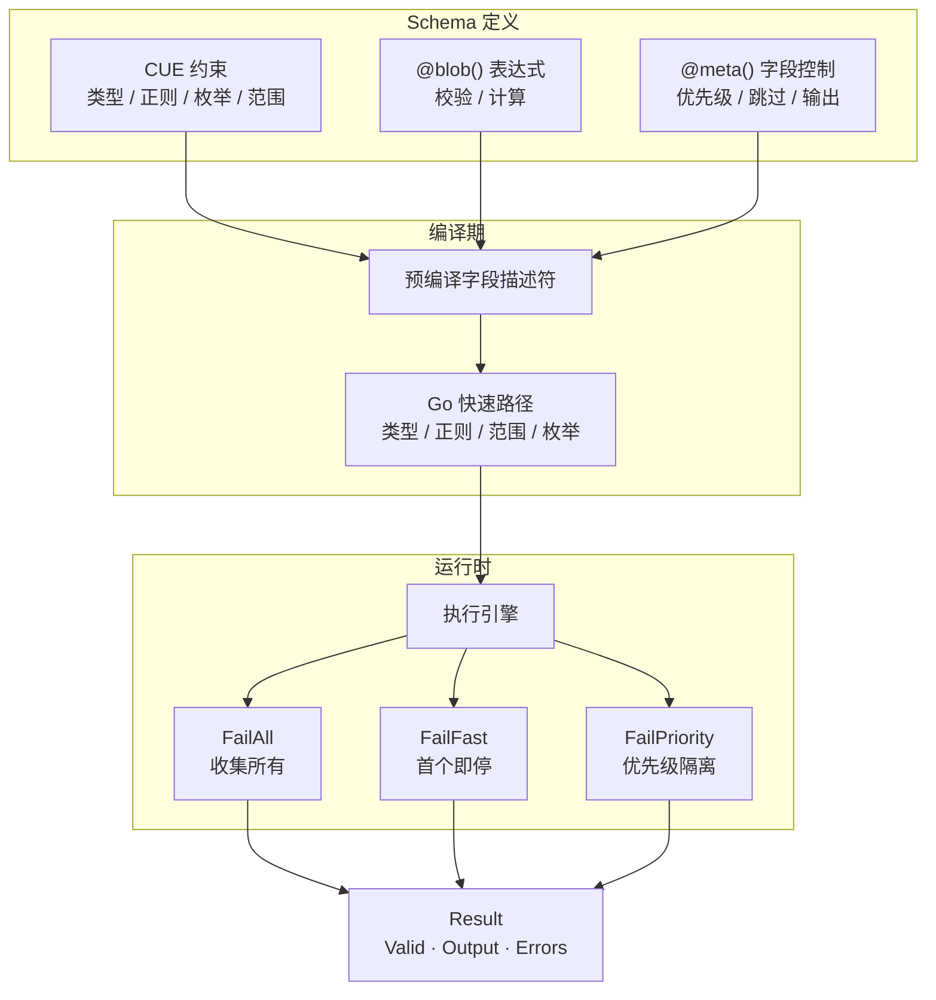

<div align="center">

# schemix

**Schema 驱动的校验与转换引擎**

CUE 约束 + Bloblang 动态表达式，统一。

[](https://pkg.go.dev/github.com/mredencom/schemix)
[](https://goreportcard.com/report/github.com/mredencom/schemix)
[](https://github.com/mredencom/schemix/actions/workflows/ci.yml)
[](LICENSE)

[English](README.md) | [中文](README_zh.md)

</div>

---



## 目录

- [特性](#特性)
- [安装](#安装)
- [快速开始](#快速开始)
- [内置校验方法](#内置校验方法)
- [API 校验](#api-校验)
- [Schema 语法](#schema-语法)
- [自定义函数与方法](#自定义函数与方法)
- [错误处理](#错误处理)
- [自定义错误消息](#自定义错误消息)
- [Schema 组合](#schema-组合)
- [Schema 自省](#schema-自省)
- [FailMode 模式](#failmode-模式)
- [错误码](#错误码)
- [Bloblang 集成](#bloblang-集成)
- [Registry 管理](#registry-管理)
- [便捷 API](#便捷-api)
- [性能基准](#性能基准)
- [许可证](#许可证)

## 特性

| 分类 | 能力 |
|------|------|
| **约束** | 类型、正则、枚举、范围、嵌套结构体、数组 `[...{schema}]`、可空 `null \| type` |
| **动态规则** | Bloblang 表达式 —— 返回 `bool` 做校验，其他类型做计算字段 |
| **内置校验** | 37+ 方法：邮箱、URL、UUID、IP、Luhn、JSON、Base64、手机号、长度、范围…… |
| **自定义函数** | 注册自有函数/方法，与 Bloblang API 完全一致（V1 & V2 风格） |
| **字段控制** | 优先级分组、条件必填/跳过、忽略空值、单字段快速失败 |
| **执行策略** | 三种 FailMode —— 收集所有 / 首个即停 / 优先级组隔离 |
| **性能** | Go 原生快速路径（2.5µs/op），预编译描述符，标量字段零 CUE 分配 |
| **错误处理** | 结构化错误码、链式 API（HasCode/ErrorsByCode/ErrorsByType）、自定义 i18n 格式化 |
| **组合复用** | CUE definitions + `NewFromValue` 实现 schema 复用，运行时自省 |
| **集成** | Method & Function 形式接入 Benthos/Redpanda Connect 管道 |
| **线程安全** | Validator 构造后只读；Registry 使用 RWMutex |

## 安装

```bash
go get github.com/mredencom/schemix@latest
```

> **要求：** Go 1.22+

## 快速开始

```go
v, err := schemix.New(`{
    pan:      =~"^[0-9]{16}$"
    amount:   int & >0
    currency: "156" | "840"

    // 内置校验方法
    luhn:       bool   @blob(this.pan.luhn_valid())
    pan_check:  bool   @blob(this.pan.has_prefix("62") || this.pan.has_prefix("4"))

    // 计算字段
    card_brand: string @blob(if this.pan.has_prefix("62") { "UnionPay" } else { "Visa" })
    fee:        number @blob(if this.currency == "156" { 0 } else { (this.amount * 0.015).ceil() })
}`)

r := v.Process(map[string]any{
    "pan": "4111111111111111", "amount": int64(10000), "currency": "840",
})

r.Valid                // true
r.Output["card_brand"] // "Visa"
r.Output["fee"]        // 150
```

## 内置校验方法

所有方法在 `@blob()` 表达式中自动可用，无需注册。

### 字符串格式

| 方法 | 用法 | 说明 |
|------|------|------|
| `is_email()` | `this.email.is_email()` | 邮箱地址格式 |
| `is_url()` | `this.link.is_url()` | 含 scheme 的 URL |
| `is_full_url()` | `this.cb.is_full_url()` | 必须以 http/https 开头 |
| `is_uuid()` | `this.id.is_uuid()` | UUID 任意版本 |
| `is_uuid3/4/5()` | `this.id.is_uuid4()` | 指定 UUID 版本 |
| `is_ip()` | `this.host.is_ip()` | IPv4 或 IPv6 |
| `is_ipv4()` / `is_ipv6()` | `this.ip.is_ipv4()` | 指定 IP 版本 |
| `is_cidr()` | `this.net.is_cidr()` | CIDR 表示法 |
| `is_mac()` | `this.mac.is_mac()` | MAC 地址 |
| `is_dns_name()` | `this.host.is_dns_name()` | DNS 主机名 |
| `is_json()` | `this.body.is_json()` | 合法 JSON 字符串 |
| `is_base64()` | `this.token.is_base64()` | Base64 编码 |
| `is_hex()` | `this.hash.is_hex()` | 十六进制字符串 |
| `is_hex_color()` | `this.color.is_hex_color()` | #RGB 或 #RRGGBB |
| `is_rgb_color()` | `this.color.is_rgb_color()` | rgb(r,g,b) |
| `is_data_uri()` | `this.img.is_data_uri()` | data:mime;base64,... |
| `is_latitude()` | `this.lat.is_latitude()` | -90 到 90 |
| `is_longitude()` | `this.lng.is_longitude()` | -180 到 180 |
| `is_isbn10/13()` | `this.isbn.is_isbn13()` | ISBN 格式 |
| `is_cn_mobile()` | `this.phone.is_cn_mobile()` | 中国手机号（1xx） |

### 字符类型

| 方法 | 用法 | 说明 |
|------|------|------|
| `is_alpha()` | `this.name.is_alpha()` | 仅字母 |
| `is_alpha_num()` | `this.code.is_alpha_num()` | 字母 + 数字 |
| `is_alpha_dash()` | `this.slug.is_alpha_dash()` | 字母 + 数字 + `-_` |
| `is_numeric()` | `this.pin.is_numeric()` | 仅数字（0-9） |
| `is_number()` | `this.val.is_number()` | 数字字符串（±、小数点） |
| `is_ascii()` | `this.s.is_ascii()` | 仅 ASCII |
| `is_printable_ascii()` | `this.s.is_printable_ascii()` | 可打印 ASCII（32-126） |
| `is_multibyte()` | `this.s.is_multibyte()` | 包含多字节字符 |

### 字符串检查

| 方法 | 用法 | 说明 |
|------|------|------|
| `not_blank()` | `this.name.not_blank()` | 非空白 |
| `has_whitespace()` | `this.s.has_whitespace()` | 包含空白字符 |

### 长度与范围

| 方法 | 用法 | 说明 |
|------|------|------|
| `len_between(min,max)` | `this.s.len_between(min:3, max:20)` | 字符串/数组/Map 长度 |
| `min_len(n)` | `this.s.min_len(n: 3)` | 最小长度 |
| `max_len(n)` | `this.s.max_len(n: 100)` | 最大长度 |
| `str_len(min,max)` | `this.s.str_len(min:2, max:10)` | 字符数（rune）范围 |
| `between(min,max)` | `this.age.between(min:0, max:150)` | 数值范围（闭区间） |

### 金融

| 方法 | 用法 | 说明 |
|------|------|------|
| `luhn_valid()` | `this.pan.luhn_valid()` | Luhn 校验（银行卡号） |

### 日期函数

| 函数 | 用法 | 说明 |
|------|------|------|
| `is_valid_date(d)` | `is_valid_date(this.date)` | 可解析的日期字符串 |
| `is_past_date(d)` | `is_past_date(this.birthday)` | 日期在过去 |
| `is_future_date(d)` | `is_future_date(this.expiry)` | 日期在未来 |

## API 校验

启动时预编译，每次请求零编译开销：

```go
var userSchema = schemix.MustNew(`{
    username: =~"^[a-zA-Z][a-zA-Z0-9_]{2,20}$"
    email:    string @blob(this.email.is_email())
    password: string @blob(this.password.len_between(min: 8, max: 64))
    age:      int    @blob(this.age.between(min: 13, max: 150))
    role:     "admin" | "user" | "guest"
}`, schemix.WithErrorFormatter(apiFormatter))

func CreateUser(w http.ResponseWriter, req *http.Request) {
    var body map[string]any
    json.NewDecoder(req.Body).Decode(&body)

    r := userSchema.ProcessWithMode(body, schemix.FailAll)
    if !r.Valid {
        status := http.StatusBadRequest
        if r.HasCode(schemix.CodeRequiredMissing) {
            status = http.StatusUnprocessableEntity
        }
        w.WriteHeader(status)
        json.NewEncoder(w).Encode(map[string]any{
            "error":   "validation_failed",
            "details": r.Errors,
        })
        return
    }
    // 使用 r.Output ...
}
```

## Schema 语法

### CUE 约束

| 语法 | 含义 | 示例 |
|------|------|------|
| `string` / `int` / `float` / `bool` | 类型约束 | `name: string` |
| `& >=N & <=M` | 范围 | `age: int & >=0 & <=150` |
| `=~"regex"` | 正则匹配 | `pan: =~"^[0-9]{16}$"` |
| `"a" \| "b"` | 枚举 | `currency: "156" \| "840"` |
| `?` | 可选字段 | `memo?: string` |
| `null \| type` | 可空 | `memo: null \| string` |
| `{...}` | 嵌套结构 | `address: { city: string }` |
| `[...{schema}]` | 数组 schema | `items: [...{id: string}]` |

### @blob() — Bloblang 表达式

| 返回类型 | 行为 | 示例 |
|----------|------|------|
| `bool = true` | 校验通过 | `@blob(this.amount > 0)` |
| `bool = false` | 校验失败（→ E2B01） | `@blob(this.age >= 18)` |
| 非 bool | 计算值 → 写入 Output | `@blob(this.first + " " + this.last)` |
| 逗号分隔 | AND — 各自独立 | `@blob(expr1, expr2)` |

### @meta() — 字段行为控制

| 参数 | 类型 | 含义 |
|------|------|------|
| `priority=N` | int | 执行优先级（数字小优先） |
| `optional` | flag | 字段缺失不报错 |
| `conditional` | flag | 条件可选（配合 required_if） |
| `skip_empty` | flag | 空值时跳过校验 |
| `fail_fast` | flag | 失败后跳过该字段后续规则 |
| `omit_if_skip` | flag | 跳过时从 Output 移除 |
| `omit_empty` | flag | 空值时从 Output 移除 |
| `required_if=expr` | bloblang | 条件必填 |
| `skip_if=expr` | bloblang | 条件跳过 |

<details>
<summary><b>组合示例</b></summary>

```cue
{
    payment_type: "credit" | "debit"
    cvv: string @meta(conditional, required_if=this.payment_type == "credit")

    pan: =~"^[0-9]{16}$" @meta(priority=1)
    luhn_check: bool @blob(this.pan.luhn_valid()) @meta(priority=2)

    memo?: string @meta(optional, omit_empty)
    fee?: number @meta(optional, skip_if=this.payment_type == "debit", omit_if_skip)
}
```

</details>

## 自定义函数与方法

使用与 Bloblang 完全一致的 API 注册自定义校验逻辑 —— 每个 Validator 独立隔离：

```go
// 函数风格：my_func(args...)
v, _ := schemix.New(schema, schemix.WithFunction("check_blacklist",
    func(args ...any) (bloblang.Function, error) {
        pan := args[0].(string)
        return func() (any, error) {
            return !isBlocked(pan), nil
        }, nil
    },
))

// 方法风格：this.field.my_method()
v, _ := schemix.New(schema, schemix.WithMethod("is_valid_bin",
    func(v any) (any, error) {
        return checkBIN(v.(string)), nil
    },
))

// V2 风格：带类型参数（PluginSpec + ParsedParams）
v, _ := schemix.New(schema, schemix.WithFunctionV2("calc_fee",
    bloblang.NewPluginSpec().
        Param(bloblang.NewInt64Param("amount")).
        Param(bloblang.NewFloat64Param("rate")),
    func(args *bloblang.ParsedParams) (bloblang.Function, error) {
        amount, _ := args.GetInt64("amount")
        rate, _ := args.GetFloat64("rate")
        return func() (any, error) { return float64(amount) * rate, nil }, nil
    },
))

// V2 方法带参数：this.field.method(param: value)
v, _ := schemix.New(schema, schemix.WithMethodV2("in_range",
    bloblang.NewPluginSpec().
        Param(bloblang.NewInt64Param("min")).
        Param(bloblang.NewInt64Param("max")),
    func(args *bloblang.ParsedParams) (bloblang.Method, error) {
        min, _ := args.GetInt64("min")
        max, _ := args.GetInt64("max")
        return func(v any) (any, error) {
            n := v.(int64)
            return n >= min && n <= max, nil
        }, nil
    },
))
```

### FuncMap（可复用集合）

多个自定义函数时，使用 `FuncMap` 构建一次、处处复用：

```go
funcs := schemix.NewFuncMap(
    schemix.Func("check_blacklist", blacklistFn),
    schemix.Func("calc_fee", feeFn),
    schemix.Method("mask_pan", maskFn),
    schemix.MethodV2("in_range", rangeSpec, rangeCtor),
)

// 多个 Validator 共享
v1, _ := schemix.New(schema1, schemix.WithFuncMap(funcs))
v2, _ := schemix.New(schema2, schemix.WithFuncMap(funcs))
```

名称在构建时校验（必须 snake_case：`/^[a-z0-9]+(_[a-z0-9]+)*$/`）。

### 覆盖内置校验方法

内置名称默认受保护。使用 `WithOverrideMethod` 或 `WithOverrideFunc` 显式覆盖：

```go
// 覆盖指定的内置方法
v, _ := schemix.New(schema,
    schemix.WithOverrideMethod("is_email"),
    schemix.WithMethod("is_email", myStrictEmailFn),
)

// 覆盖指定的内置函数
v, _ := schemix.New(schema,
    schemix.WithOverrideFunc("is_valid_date"),
    schemix.WithFunction("is_valid_date", myDateFn),
)

// 全量覆盖 — 关闭所有冲突检测
v, _ := schemix.New(schema, schemix.WithOverrideAll(), schemix.WithFuncMap(myFuncs))
```

> 注意：Function 和 Method 是独立的命名空间。注册 **Function** `is_email`
> 不会与内置 **Method** `is_email` 冲突。

## 错误处理

```go
r := v.Process(data)

r.Valid                              // bool
r.Err()                              // 合并 error（valid 时为 nil）
r.FirstError()                       // *ValidationError
r.ErrorsByPath("pan")                // []ValidationError
r.ErrorsByCode(schemix.CodeTypeMismatch) // []ValidationError
r.ErrorsByType("cue")                // []ValidationError — 按层过滤
r.HasCode(schemix.CodeBizRuleFailed) // bool — 快速分类检查
r.HasErrorsAt("email")              // bool — 字段级检查
r.ErrorMessages()                    // 换行拼接的字符串
```

## 自定义错误消息

提供自定义 `ErrorFormatter` 实现 i18n 或面向用户的消息：

```go
v := schemix.MustNew(schema, schemix.WithErrorFormatter(
    func(code schemix.ErrorCode, path, detail string) string {
        return i18n.T("zh-CN", string(code), path)
    },
))
```

格式化函数接收错误码、字段路径和默认消息，返回你需要的用户友好字符串。
未设置时，默认透传原始 CUE/Bloblang 错误消息。

## Schema 组合

使用 `NewFromValue` 从预编译的 CUE Value 构建 Validator，通过 CUE definitions 实现复用：

```go
ctx := cuecontext.New()
schema := ctx.CompileString(`{
    #PAN:      =~"^[0-9]{16}$"
    #Amount:   int & >0
    #Currency: "CNY" | "USD" | "EUR"

    pan:      #PAN
    amount:   #Amount
    currency: #Currency
}`)

v, err := schemix.NewFromValue(schema)
```

## Schema 自省

运行时检查 schema 结构，用于自动生成文档或 UI：

```go
fields := v.Fields() // []FieldInfo

for _, f := range fields {
    fmt.Printf("%s: %s (optional=%v, blob=%v)\n", f.Path, f.Type, f.Optional, f.HasBlob)
    for _, child := range f.Children {
        fmt.Printf("  %s: %s\n", child.Path, child.Type)
    }
}
```

## FailMode 模式

| 模式 | 适用场景 | 行为 |
|------|----------|------|
| `FailAll` | 表单校验 | 收集所有错误 |
| `FailFast` | API 网关 | 遇到第一个错误即停 |
| `FailPriority` | 分层校验 | 优先级组隔离 |

```go
r := v.ProcessWithMode(data, schemix.FailFast)     // 最多 1 个错误
r := v.ProcessWithMode(data, schemix.FailAll)      // 所有错误
r := v.ProcessWithMode(data, schemix.FailPriority) // p1 失败 → 跳过 p2+
```

## 错误码

格式：`E{层}{分类}{序号}`

| 常量 | 码 | 层 | 含义 |
|------|----|----|------|
| `CodeFormatMismatch` | E1F01 | CUE | 正则格式不匹配 |
| `CodeTypeMismatch` | E1T01 | CUE | 类型错误 |
| `CodeEnumInvalid` | E1E01 | CUE | 枚举值非法 |
| `CodeRangeViolation` | E1R01 | CUE | 范围越界 |
| `CodeRequiredMissing` | E1M01 | CUE | 必填字段缺失 |
| `CodeArrayElement` | E1A01 | CUE | 数组元素校验失败 |
| `CodeCUEOther` | E1X01 | CUE | 其他 CUE 错误 |
| `CodeBizRuleFailed` | E2B01 | Blob | 业务规则返回 false |
| `CodeExprExecError` | E2X01 | Blob | 表达式执行错误 |
| `CodeCondRequired` | E3C01 | Meta | 条件必填未满足 |

## Bloblang 集成

```go
reg := schemix.NewRegistry()
reg.Register("payment", cueSrc)
reg.RegisterAll() // 注册 method + function 形式
```

**Method 形式** — 校验 `this`：
```yaml
let r = this.process_schema(name: "payment", mode: "fast")
```

**Function 形式** — 动态数据源：
```yaml
let r = process_schema(data: this.payload, name: "payment")
```

## Registry 管理

```go
reg := schemix.NewRegistry()       // 内部共享 CUE context
reg.Register("user", cueSrc)       // 编译 + 存储
reg.Has("user")                    // true
reg.List()                         // ["user"]
reg.Len()                          // 1
reg.Unregister("user")             // 移除
```

## 便捷 API

```go
// 构造
v := schemix.MustNew(cueSrc)                    // 出错 panic
v, _ := schemix.NewWithContext(ctx, src)         // 共享 CUE context
v, _ := schemix.NewFromValue(cueValue)           // 从预编译 CUE Value

// 选项
schemix.WithErrorFormatter(fn)                   // 自定义错误消息
schemix.WithFunction(name, ctor)                 // 自定义函数（V1）
schemix.WithFunctionV2(name, spec, ctor)         // 自定义函数（V2）
schemix.WithMethod(name, fn)                     // 自定义方法（V1）
schemix.WithMethodV2(name, spec, ctor)           // 自定义方法（V2）

// 纯校验（快速路径 — 不分配 Output）
valid, errs := v.Validate(data)

// 处理（校验 + 计算字段）
r := v.Process(data)
r := v.ProcessWithMode(data, schemix.FailFast)

// 自省
fields := v.Fields()                             // []FieldInfo
```

## 性能基准

Apple M4, Go 1.25 — 6 字段（3 CUE + 3 @blob）：

| 操作 | 耗时 | 内存 | 分配次数 |
|------|------|------|----------|
| `New`（编译） | 430 µs | 808 KB | 22195 |
| `Process`（合法） | **2.5 µs** | 4.0 KB | 61 |
| `Process`（非法） | 2.9 µs | 4.7 KB | 75 |
| `Process`（嵌套） | 28 µs | 40 KB | 456 |
| `Validate`（无输出） | 2.4 µs | 3.6 KB | 57 |
| `Registry.Get` | 5.6 ns | 0 B | 0 |

> 简单标量字段使用 Go 原生快速路径，完全绕过 CUE，
> 相比 CUE Unify 路径实现 **127 倍加速**（校验层 115ns vs 14.6µs）。

## 许可证

[MIT](LICENSE)
