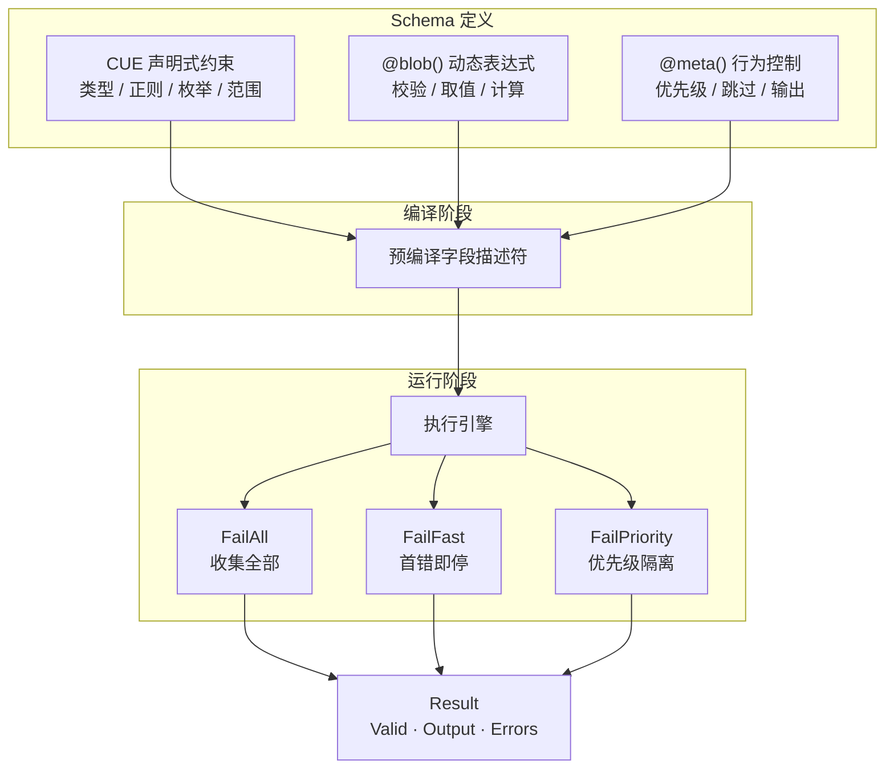

<div align="center">

# schemix

**模式驱动的校验与转换引擎**

CUE 声明式约束 + Bloblang 动态表达式，混合统一。

[](https://pkg.go.dev/github.com/mredencom/schemix)
[](https://goreportcard.com/report/github.com/mredencom/schemix)
[](https://github.com/mredencom/schemix/actions/workflows/ci.yml)
[](LICENSE)

[English](README.md) | [中文](README_zh.md)

</div>

---



## 目录

- [特性](#特性)
- [安装](#安装)
- [快速开始](#快速开始)
- [API 接口校验](#api-接口校验)
- [Schema 语法](#schema-语法)
- [失败模式](#失败模式)
- [错误码](#错误码)
- [Bloblang 集成](#bloblang-集成)
- [Registry 管理](#registry-管理)
- [便捷 API](#便捷-api)
- [性能基准](#性能基准)
- [License](#license)

## 特性

| 分类 | 能力 |
|------|------|
| **约束** | 类型、正则、枚举、范围、嵌套 struct、数组 `[...{schema}]`、可空 `null \| type` |
| **动态规则** | Bloblang 表达式 — 返回 `bool` 做校验，返回其他类型做计算字段 |
| **字段控制** | 优先级分组、条件必填/跳过、空值省略、字段级 fail-fast |
| **执行策略** | 三种 FailMode — 收集全部 / 首错即停 / 优先级组隔离 |
| **性能** | 预编译字段描述符、CUE 层跳过 @blob 字段、Go 层快速存在性检查 |
| **集成** | Method 和 Function 两种形式，嵌入 Benthos/Redpanda Connect 流水线 |
| **管理** | 线程安全 Registry，支持 Has/Unregister/List/Len，内部共享 CUE Context |
| **错误处理** | 结构化 `E{层}{类}{序}` 错误码、实现 `error` 接口、按路径过滤 |

## 安装

```bash
go get github.com/mredencom/schemix@latest
```

> **要求：** Go 1.22+

## 快速开始

```go
v, err := schemix.New(`{
    pan:      =~"^[0-9]{16}$"
    amount:   int & >0
    currency: "156" | "840"

    pan_check:  bool   @blob(this.pan.has_prefix("62") || this.pan.has_prefix("4"))
    card_brand: string @blob(if this.pan.has_prefix("62") { "UnionPay" } else { "Visa" })
    fee:        number @blob(if this.currency == "156" { 0 } else { (this.amount * 0.015).ceil() })
}`)

r := v.Process(map[string]any{
    "pan": "6222021234567890", "amount": int64(10000), "currency": "156",
})

r.Valid                // true
r.Output["card_brand"] // "UnionPay"
r.Output["fee"]        // 0
```

## API 接口校验

启动时预编译 schema，请求时零编译开销：

```go
var userSchema = schemix.MustNew(`{
    username: =~"^[a-zA-Z][a-zA-Z0-9_]{2,20}$"
    email:    =~"^[a-zA-Z0-9._%+-]+@[a-zA-Z0-9.-]+\\.[a-zA-Z]{2,}$"
    password: =~"^.{8,64}$"
    role:     "admin" | "user" | "guest"
}`)

func CreateUser(w http.ResponseWriter, req *http.Request) {
    var body map[string]any
    json.NewDecoder(req.Body).Decode(&body)

    r := userSchema.ProcessWithMode(body, schemix.FailAll)
    if !r.Valid {
        w.WriteHeader(400)
        json.NewEncoder(w).Encode(map[string]any{
            "error":   "validation_failed",
            "details": r.Errors,
        })
        return
    }
    // 使用 r.Output（包含计算字段）...
}
```

## Schema 语法

### CUE 约束

| 语法 | 含义 | 示例 |
|------|------|------|
| `string` / `int` / `float` / `bool` | 类型约束 | `name: string` |
| `& >=N & <=M` | 范围 | `age: int & >=0 & <=150` |
| `=~"regex"` | 正则匹配 | `pan: =~"^[0-9]{16}$"` |
| `"a" \| "b"` | 枚举 | `currency: "156" \| "840"` |
| `?` | 可选字段 | `memo?: string` |
| `null \| type` | 可空类型 | `memo: null \| string` |
| `{...}` | 嵌套对象 | `address: { city: string }` |
| `[...{schema}]` | 数组校验 | `items: [...{id: string}]` |

### @blob() — Bloblang 表达式

| 返回类型 | 行为 | 示例 |
|----------|------|------|
| `bool = true` | 校验通过 | `@blob(this.amount > 0)` |
| `bool = false` | 校验失败（→ E2B01） | `@blob(this.age >= 18)` |
| 非 bool | 计算值 → Output | `@blob(this.first + " " + this.last)` |
| 逗号分隔 | AND — 各自独立 | `@blob(expr1, expr2)` |

### @meta() — 字段行为控制

| 参数 | 类型 | 含义 |
|------|------|------|
| `priority=N` | int | 执行优先级（越小越先） |
| `optional` | flag | 字段缺失不报错 |
| `conditional` | flag | 条件可选（配合 required_if） |
| `skip_empty` | flag | 空值时跳过校验 |
| `fail_fast` | flag | 失败后跳过同字段后续规则 |
| `omit_if_skip` | flag | 被跳过时从 Output 移除 |
| `omit_empty` | flag | 空值时从 Output 移除 |
| `required_if=expr` | bloblang | 条件必填 |
| `skip_if=expr` | bloblang | 条件跳过 |

<details>
<summary><b>组合示例</b></summary>

```cue
{
    payment_type: "credit" | "debit"
    cvv: string @meta(conditional, required_if=this.payment_type == "credit")

    pan: =~"^[0-9]{16}$" @meta(priority=1)
    luhn_check: bool @blob(this.pan.luhn_valid()) @meta(priority=2)

    memo?: string @meta(optional, omit_empty)
    fee?: number @meta(optional, skip_if=this.payment_type == "debit", omit_if_skip)
}
```

</details>

## 失败模式

| 模式 | 适用场景 | 行为 |
|------|----------|------|
| `FailAll` | 表单校验 | 收集所有错误 |
| `FailFast` | API 网关 | 首个错误即停 |
| `FailPriority` | 分层校验 | 当前优先级组有错误则跳过后续组 |

```go
r := v.ProcessWithMode(data, schemix.FailFast)     // 最多 1 个错误
r := v.ProcessWithMode(data, schemix.FailAll)      // 所有错误
r := v.ProcessWithMode(data, schemix.FailPriority) // p1 失败 → 跳过 p2+
```

## 错误码

格式：`E{层级}{类别}{序号}`

| 常量 | 码值 | 层级 | 含义 |
|------|------|------|------|
| `CodeFormatMismatch` | E1F01 | CUE | 正则格式不匹配 |
| `CodeTypeMismatch` | E1T01 | CUE | 类型错误 |
| `CodeEnumInvalid` | E1E01 | CUE | 枚举值不合法 |
| `CodeRangeViolation` | E1R01 | CUE | 数值范围越界 |
| `CodeRequiredMissing` | E1M01 | CUE | 必填字段缺失 |
| `CodeArrayElement` | E1A01 | CUE | 数组元素校验失败 |
| `CodeCUEOther` | E1X01 | CUE | 其他 CUE 错误 |
| `CodeBizRuleFailed` | E2B01 | Blob | 业务规则返回 false |
| `CodeExprExecError` | E2X01 | Blob | 表达式执行异常 |
| `CodeCondRequired` | E3C01 | Meta | 条件必填未满足 |

## Bloblang 集成

```go
reg := schemix.NewRegistry()
reg.Register("payment", cueSrc)
reg.RegisterAll() // 同时注册 method + function 形式
```

**Method 形式** — 校验 `this`：
```yaml
let r = this.process_schema(name: "payment", mode: "fast")
```

**Function 形式** — 动态数据源：
```yaml
let r = process_schema(data: this.payload, name: "payment")
```

## Registry 管理

```go
reg := schemix.NewRegistry()       // 内部共享 CUE Context
reg.Register("user", cueSrc)       // 编译 + 存储
reg.Has("user")                    // true
reg.List()                         // ["user"]
reg.Len()                          // 1
reg.Unregister("user")             // 移除
```

## 便捷 API

```go
// 构造
v := schemix.MustNew(cueSrc)              // 失败 panic
v, err := schemix.NewWithContext(ctx, src) // 共享 CUE Context

// 结果
r := v.Process(data)
r.Valid                         // bool
r.Output                        // map（含计算字段）
r.Err()                         // error（nil 表示通过）
r.FirstError()                  // *ValidationError
r.ErrorsByPath("pan")           // []ValidationError
r.ErrorMessages()               // 换行分隔的错误信息
```

## 性能基准

Apple M4, Go 1.25 — 6 字段（3 CUE + 3 @blob）：

| 操作 | 耗时 | 内存 | 分配次数 |
|------|------|------|----------|
| `New`（编译） | 393 µs | 777 KB | 21894 |
| `Process`（有效数据） | **16 µs** | 41 KB | 308 |
| `Process`（无效数据） | 26 µs | 50 KB | 525 |
| `Process`（嵌套对象） | 38 µs | 68 KB | 671 |
| `Registry.Get` | 5.6 ns | 0 B | 0 |

## License

[MIT](LICENSE)
