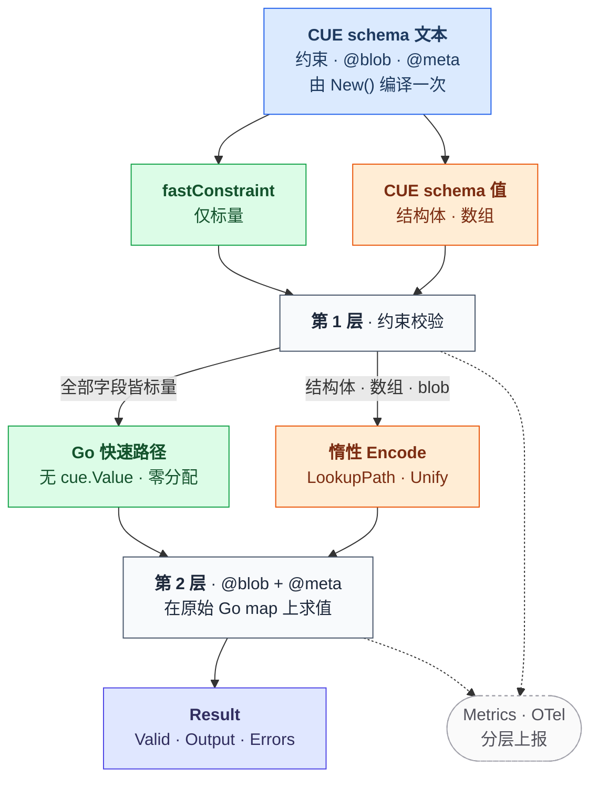

<div align="center">

# Schemix

**Schema 驱动的校验与转换引擎**

CUE 约束 + Bloblang 动态表达式，统一。

[](https://pkg.go.dev/github.com/mredencom/schemix)
[](https://github.com/mredencom/schemix/blob/main/go.mod)
[](https://github.com/mredencom/schemix/releases)
[](https://codecov.io/gh/mredencom/schemix)
[](https://github.com/mredencom/schemix/actions/workflows/ci.yml)
[](LICENSE)

[English](README.md) | [中文](README_zh.md)

</div>

---


```mermaid
%%{init: {'flowchart': {'wrappingWidth': 340, 'curve': 'basis', 'nodeSpacing': 45, 'rankSpacing': 48}}}%%
graph TD
    SRC["<b>CUE schema 文本</b><br/>约束 · @blob · @meta<br/>由 New() 编译一次"]:::schema

    SRC --> FAST["<b>fastConstraint</b><br/>仅标量"]:::fast
    SRC --> CV["<b>CUE schema 值</b><br/>结构体 · 数组"]:::slow

    FAST --> L1["<b>第 1 层</b> · 约束校验"]:::layer
    CV --> L1

    L1 -->|全部字段皆标量| Z["<b>Go 快速路径</b><br/>无 cue.Value · 零分配"]:::fast
    L1 -->|结构体 · 数组 · blob| E["<b>惰性 Encode</b><br/>LookupPath · Unify"]:::slow

    Z --> L2["<b>第 2 层</b> · @blob + @meta<br/>在原始 Go map 上求值"]:::layer
    E --> L2

    L2 --> R["<b>Result</b><br/>Valid · Output · Errors"]:::result
    L1 -.-> OBS(["Metrics · OTel<br/>分层上报"]):::obs
    L2 -.-> OBS

    classDef schema fill:#dbeafe,stroke:#2563eb,color:#1e3a5f
    classDef fast fill:#dcfce7,stroke:#16a34a,color:#14532d
    classDef slow fill:#ffedd5,stroke:#ea580c,color:#7c2d12
    classDef layer fill:#f8fafc,stroke:#475569,color:#1e293b
    classDef result fill:#e0e7ff,stroke:#4f46e5,color:#312e5f
    classDef obs fill:#fafafa,stroke:#a1a1aa,stroke-dasharray:3 3,color:#52525b
```

> 绿色是零分配路径；橙色是输入必须转换成 `cue.Value` 的路径。

## 目录

- [Schemix](#schemix)
  - [目录](#目录)
  - [特性](#特性)
  - [安装](#安装)
  - [快速开始](#快速开始)
  - [内置校验方法](#内置校验方法)
    - [字符串格式](#字符串格式)
    - [字符类型](#字符类型)
    - [字符串检查](#字符串检查)
    - [长度与范围](#长度与范围)
    - [金融](#金融)
    - [日期函数](#日期函数)
    - [比较函数](#比较函数)
  - [API 校验](#api-校验)
  - [Schema 语法](#schema-语法)
    - [CUE 约束](#cue-约束)
    - [@blob() — Bloblang 表达式](#blob--bloblang-表达式)
    - [@meta() — 字段行为控制](#meta--字段行为控制)
    - [数组](#数组)
  - [自定义函数与方法](#自定义函数与方法)
    - [FuncMap（可复用集合）](#funcmap可复用集合)
    - [覆盖内置校验方法](#覆盖内置校验方法)
  - [错误处理](#错误处理)
  - [自定义错误消息](#自定义错误消息)
  - [Schema 组合](#schema-组合)
  - [Schema 自省](#schema-自省)
  - [FailMode 模式](#failmode-模式)
  - [错误码](#错误码)
  - [Bloblang 集成](#bloblang-集成)
  - [Registry 管理](#registry-管理)
  - [可观测性](#可观测性)
    - [指标](#指标)
    - [开箱可用的 recorder](#开箱可用的-recorder)
    - [追踪](#追踪)
  - [便捷 API](#便捷-api)
  - [性能基准](#性能基准)
  - [同类库对比](#同类库对比)
  - [许可证](#许可证)

## 特性

| 分类 | 能力 |
|------|------|
| **约束** | 类型、正则、枚举、范围、嵌套结构体、数组 `[...{schema}]`、可空 `null \| type` |
| **动态规则** | Bloblang 表达式 —— 返回 `bool` 做校验，其他类型做计算字段 |
| **内置校验** | 37+ 方法：邮箱、URL、UUID、IP、Luhn、JSON、Base64、手机号、长度、范围…… |
| **自定义函数** | 注册自有函数/方法，与 Bloblang API 完全一致（V1 & V2 风格） |
| **字段控制** | 优先级分组、条件必填/跳过、忽略空值、单字段快速失败 |
| **执行策略** | 三种 FailMode —— 收集所有 / 首个即停 / 优先级组隔离 |
| **性能** | 预编译描述符；纯标量 schema **382 ns 完成校验且零分配** —— `cue.Context.Encode` 被完全跳过 |
| **可观测性** | `MetricsRecorder` 钩子 + OpenTelemetry 追踪；开箱可用的 `schemixprom` / `schemixotel` recorder |
| **错误处理** | 结构化错误码、链式 API（HasCode/ErrorsByCode/ErrorsByType）、自定义 i18n 格式化 |
| **组合复用** | CUE definitions + `NewFromValue` 实现 schema 复用，运行时自省 |
| **集成** | Method & Function 形式接入 Benthos/Redpanda Connect 管道 |
| **线程安全** | Validator 构造后只读；Registry 使用 RWMutex |

## 安装

```bash
go get github.com/mredencom/schemix@latest
```

> **要求：** Go 1.25.0 或更高版本

## 快速开始

```go
v, err := schemix.New(`{
    pan:      =~"^[0-9]{16}$"
    amount:   int & >0
    currency: "156" | "840"

    // 内置校验方法
    luhn:       bool   @blob(this.pan.luhn_valid())
    pan_check:  bool   @blob(this.pan.has_prefix("62") || this.pan.has_prefix("4"))

    // 计算字段
    card_brand: string @blob(if this.pan.has_prefix("62") { "UnionPay" } else { "Visa" })
    fee:        number @blob(if this.currency == "156" { 0 } else { (this.amount * 0.015).ceil() })
}`)

r := v.Process(map[string]any{
    "pan": "4111111111111111", "amount": int64(10000), "currency": "840",
})

r.Valid                // true
r.Output["card_brand"] // "Visa"
r.Output["fee"]        // 150
```

## 内置校验方法

所有方法在 `@blob()` 表达式中自动可用，无需注册。

### 字符串格式

| 方法 | 用法 | 说明 |
|------|------|------|
| `is_email()` | `this.email.is_email()` | 邮箱地址格式 |
| `is_url()` | `this.link.is_url()` | 含 scheme 的 URL |
| `is_full_url()` | `this.cb.is_full_url()` | 必须以 http/https 开头 |
| `is_uuid()` | `this.id.is_uuid()` | UUID 任意版本 |
| `is_uuid3/4/5()` | `this.id.is_uuid4()` | 指定 UUID 版本 |
| `is_ip()` | `this.host.is_ip()` | IPv4 或 IPv6 |
| `is_ipv4()` / `is_ipv6()` | `this.ip.is_ipv4()` | 指定 IP 版本 |
| `is_cidr()` | `this.net.is_cidr()` | CIDR 表示法 |
| `is_mac()` | `this.mac.is_mac()` | MAC 地址 |
| `is_dns_name()` | `this.host.is_dns_name()` | DNS 主机名 |
| `is_json()` | `this.body.is_json()` | 合法 JSON 字符串 |
| `is_base64()` | `this.token.is_base64()` | Base64 编码 |
| `is_hex()` | `this.hash.is_hex()` | 十六进制字符串 |
| `is_hex_color()` | `this.color.is_hex_color()` | #RGB 或 #RRGGBB |
| `is_rgb_color()` | `this.color.is_rgb_color()` | rgb(r,g,b) |
| `is_data_uri()` | `this.img.is_data_uri()` | data:mime;base64,... |
| `is_latitude()` | `this.lat.is_latitude()` | -90 到 90 |
| `is_longitude()` | `this.lng.is_longitude()` | -180 到 180 |
| `is_isbn10/13()` | `this.isbn.is_isbn13()` | ISBN 格式 |
| `is_cn_mobile()` | `this.phone.is_cn_mobile()` | 中国手机号（1xx） |

### 字符类型

| 方法 | 用法 | 说明 |
|------|------|------|
| `is_alpha()` | `this.name.is_alpha()` | 仅字母 |
| `is_alpha_num()` | `this.code.is_alpha_num()` | 字母 + 数字 |
| `is_alpha_dash()` | `this.slug.is_alpha_dash()` | 字母 + 数字 + `-_` |
| `is_numeric()` | `this.pin.is_numeric()` | 仅数字（0-9） |
| `is_number()` | `this.val.is_number()` | 数字字符串（±、小数点） |
| `is_ascii()` | `this.s.is_ascii()` | 仅 ASCII |
| `is_printable_ascii()` | `this.s.is_printable_ascii()` | 可打印 ASCII（32-126） |
| `is_multibyte()` | `this.s.is_multibyte()` | 包含多字节字符 |

### 字符串检查

| 方法 | 用法 | 说明 |
|------|------|------|
| `not_blank()` | `this.name.not_blank()` | 非空白 |
| `has_whitespace()` | `this.s.has_whitespace()` | 包含空白字符 |

### 长度与范围

| 方法 | 用法 | 说明 |
|------|------|------|
| `len_between(min,max)` | `this.s.len_between(min:3, max:20)` | 字符串/数组/Map 长度 |
| `min_len(n)` | `this.s.min_len(n: 3)` | 最小长度 |
| `max_len(n)` | `this.s.max_len(n: 100)` | 最大长度 |
| `str_len(min,max)` | `this.s.str_len(min:2, max:10)` | 字符数（rune）范围 |
| `between(min,max)` | `this.age.between(min:0, max:150)` | 数值范围（闭区间） |

### 金融

| 方法 | 用法 | 说明 |
|------|------|------|
| `luhn_valid()` | `this.pan.luhn_valid()` | Luhn 校验（银行卡号） |

### 日期函数

| 函数 | 用法 | 说明 |
|------|------|------|
| `is_valid_date(d)` | `is_valid_date(this.date)` | 可解析的日期字符串 |
| `is_past_date(d)` | `is_past_date(this.birthday)` | 日期在过去 |
| `is_future_date(d)` | `is_future_date(this.expiry)` | 日期在未来 |

### 比较函数

| 函数 | 用法 | 说明 |
|------|------|------|
| `in_list(value, candidates)` | `in_list(this.status, ["active","pending"])` | 值是否在列表中 |

## API 校验

启动时预编译，每次请求零编译开销：

```go
var userSchema = schemix.MustNew(`{
    username: =~"^[a-zA-Z][a-zA-Z0-9_]{2,20}$"
    email:    string @blob(this.email.is_email())
    password: string @blob(this.password.len_between(min: 8, max: 64))
    age:      int    @blob(this.age.between(min: 13, max: 150))
    role:     "admin" | "user" | "guest"
}`, schemix.WithErrorFormatter(apiFormatter))

func CreateUser(w http.ResponseWriter, req *http.Request) {
    var body map[string]any
    json.NewDecoder(req.Body).Decode(&body)

    r := userSchema.ProcessWithMode(body, schemix.FailAll)
    if !r.Valid {
        status := http.StatusBadRequest
        if r.HasCode(schemix.CodeRequiredMissing) {
            status = http.StatusUnprocessableEntity
        }
        w.WriteHeader(status)
        json.NewEncoder(w).Encode(map[string]any{
            "error":   "validation_failed",
            "details": r.Errors,
        })
        return
    }
    // 使用 r.Output ...
}
```

## Schema 语法

### CUE 约束

| 语法 | 含义 | 示例 |
|------|------|------|
| `string` / `int` / `float` / `bool` | 类型约束 | `name: string` |
| `& >=N & <=M` | 范围 | `age: int & >=0 & <=150` |
| `=~"regex"` | 正则匹配 | `pan: =~"^[0-9]{16}$"` |
| `"a" \| "b"` | 枚举 | `currency: "156" \| "840"` |
| `?` | 可选字段 | `memo?: string` |
| `null \| type` | 可空 | `memo: null \| string` |
| `{...}` | 嵌套结构 | `address: { city: string }` |
| `[...{schema}]` | 数组 schema | `items: [...{id: string}]` |

### @blob() — Bloblang 表达式

| 返回类型 | 行为 | 示例 |
|----------|------|------|
| `bool = true` | 校验通过 | `@blob(this.amount > 0)` |
| `bool = false` | 校验失败（→ E2B01） | `@blob(this.age >= 18)` |
| 非 bool | 计算值 → 写入 Output | `@blob(this.first + " " + this.last)` |
| 逗号分隔 | AND — 各自独立 | `@blob(expr1, expr2)` |

### @meta() — 字段行为控制

| 参数 | 类型 | 含义 |
|------|------|------|
| `priority=N` | int | 执行优先级（数字小优先） |
| `optional` | flag | 字段缺失不报错 |
| `conditional` | flag | 条件可选（配合 required_if） |
| `skip_empty` | flag | 空值时跳过校验 |
| `fail_fast` | flag | 失败后跳过该字段后续规则 |
| `omit_if_skip` | flag | 跳过时从 Output 移除 |
| `omit_empty` | flag | 空值时从 Output 移除 |
| `required_if=expr` | bloblang | 条件必填 |
| `skip_if=expr` | bloblang | 条件跳过 |

<details>
<summary><b>组合示例</b></summary>

```cue
{
    payment_type: "credit" | "debit"
    cvv: string @meta(conditional, required_if=this.payment_type == "credit")

    pan: =~"^[0-9]{16}$" @meta(priority=1)
    luhn_check: bool @blob(this.pan.luhn_valid()) @meta(priority=2)

    memo?: string @meta(optional, omit_empty)
    fee?: number @meta(optional, skip_if=this.payment_type == "debit", omit_if_skip)
}
```

</details>

### 数组

元素结构用 CUE 表达；跨元素规则与元素级计算挂在**数组字段本身**：

```cue
{
    items: [...{
        product:   =~"^.{3,50}$"
        price:     number & >0
        qty:       int & >=1
        subtotal?: number              // 计算字段 —— 必须是 optional，见下
    }] @blob(
        this.items.length() > 0,                                        // 校验
        this.items.map_each(this.price * this.qty).sum() <= 100000,      // 校验
        this.items.map_each(this.merge({"subtotal": this.price * this.qty}))  // 转换
    )
}
```

逗号分隔的表达式各自独立：返回 `bool` 的做校验；返回非 bool 会**替换整个数组**，
这正是给每个元素补计算字段的方式。

**错误路径按层不同** —— 凡是 CUE 能表达的约束都优先用 CUE，因为只有 CUE 会报出元素下标：

| 违反的是 | 错误码 | 路径 |
|----------|--------|------|
| CUE 元素约束 | `E1R01` / `E1T01` / `E1F01` | `items[1].price` |
| `@blob` 规则 | `E2B01` | `items` |

常用 Bloblang 数组方法：`all(i -> …)`、`any(i -> …)`、`length()`、
`map_each(…)`、`filter(i -> …)`、`index(n)`、`sum()`。

> **`all()` 对空数组返回 false** —— 与 JavaScript 的 `every()`、Python 的 `all()` 相反。
> 请显式写明意图：要求非空用 `this.items.length() > 0 && this.items.all(…)`，
> 允许空数组用 `this.items.length() == 0 || this.items.all(…)`。

> **元素的计算字段必须声明为 optional**（`subtotal?: number`）。
> CUE 层在 `@blob` 之前执行，若把待计算的字段声明为必填，
> 会在规则执行之前就以 `E1M01` 失败。

> **元素 schema 内部的 attribute 会被拒绝。** `items: [...{qty: int @blob(…)}]`
> 会让 `New()` 返回错误 —— 规则是按字段路径编译的，而元素下标在运行时才确定，
> 该 attribute 会被静默丢弃并放过非法数据。错误信息会指出出错路径和正确写法。

## 自定义函数与方法

使用与 Bloblang 完全一致的 API 注册自定义校验逻辑 —— 每个 Validator 独立隔离：

```go
// 函数风格：my_func(args...)
v, _ := schemix.New(schema, schemix.WithFunction("check_blacklist",
    func(args ...any) (bloblang.Function, error) {
        pan := args[0].(string)
        return func() (any, error) {
            return !isBlocked(pan), nil
        }, nil
    },
))

// 方法风格：this.field.my_method()
v, _ := schemix.New(schema, schemix.WithMethod("is_valid_bin",
    func(v any) (any, error) {
        return checkBIN(v.(string)), nil
    },
))

// V2 风格：带类型参数（PluginSpec + ParsedParams）
v, _ := schemix.New(schema, schemix.WithFunctionV2("calc_fee",
    bloblang.NewPluginSpec().
        Param(bloblang.NewInt64Param("amount")).
        Param(bloblang.NewFloat64Param("rate")),
    func(args *bloblang.ParsedParams) (bloblang.Function, error) {
        amount, _ := args.GetInt64("amount")
        rate, _ := args.GetFloat64("rate")
        return func() (any, error) { return float64(amount) * rate, nil }, nil
    },
))

// V2 方法带参数：this.field.method(param: value)
v, _ := schemix.New(schema, schemix.WithMethodV2("in_range",
    bloblang.NewPluginSpec().
        Param(bloblang.NewInt64Param("min")).
        Param(bloblang.NewInt64Param("max")),
    func(args *bloblang.ParsedParams) (bloblang.Method, error) {
        min, _ := args.GetInt64("min")
        max, _ := args.GetInt64("max")
        return func(v any) (any, error) {
            n := v.(int64)
            return n >= min && n <= max, nil
        }, nil
    },
))
```

### FuncMap（可复用集合）

多个自定义函数时，使用 `FuncMap` 构建一次、处处复用：

```go
funcs := schemix.NewFuncMap(
    schemix.Func("check_blacklist", blacklistFn),
    schemix.Func("calc_fee", feeFn),
    schemix.Method("mask_pan", maskFn),
    schemix.MethodV2("in_range", rangeSpec, rangeCtor),
)

// 多个 Validator 共享
v1, _ := schemix.New(schema1, schemix.WithFuncMap(funcs))
v2, _ := schemix.New(schema2, schemix.WithFuncMap(funcs))
```

名称在构建时校验（必须 snake_case：`/^[a-z0-9]+(_[a-z0-9]+)*$/`）。

### 覆盖内置校验方法

内置名称默认受保护。使用 `WithOverrideMethod` 或 `WithOverrideFunc` 显式覆盖：

```go
// 覆盖指定的内置方法
v, _ := schemix.New(schema,
    schemix.WithOverrideMethod("is_email"),
    schemix.WithMethod("is_email", myStrictEmailFn),
)

// 覆盖指定的内置函数
v, _ := schemix.New(schema,
    schemix.WithOverrideFunc("is_valid_date"),
    schemix.WithFunction("is_valid_date", myDateFn),
)

// 全量覆盖 — 关闭所有冲突检测
v, _ := schemix.New(schema, schemix.WithOverrideAll(), schemix.WithFuncMap(myFuncs))
```

> 注意：Function 和 Method 是独立的命名空间。注册 **Function** `is_email`
> 不会与内置 **Method** `is_email` 冲突。

## 错误处理

```go
r := v.Process(data)

r.Valid                              // bool
r.Err()                              // 合并后的 error（合法时为 nil）
r.FirstError()                       // *ValidationError
r.ErrorsByPath("pan")                // []ValidationError
r.ErrorsByCode(schemix.CodeTypeMismatch) // []ValidationError
r.ErrorsByType("cue")                // []ValidationError —— 按层过滤
r.HasCode(schemix.CodeBizRuleFailed) // bool —— 快速分类判断
r.HasErrorsAt("email")              // bool —— 字段级判断
r.ErrorMessages()                    // 换行拼接的字符串
```

每条 `ValidationError` 携带：

| 字段 | 含义 |
|------|------|
| `Code` | 稳定错误码（`E1E01`、`E2B01`…） |
| `Path` | 字段路径 —— `items[0].price`、`order.customer.age` |
| `Type` | 产生它的层 —— `cue`、`bloblang`、`meta` |
| `FieldType` | 字段的 schema 类型 —— `string`、`int`、`list`…（不适用时为空） |
| `Message` | 原始诊断信息：CUE/Bloblang 原文，用于日志 |
| `Suggestion` | 最接近的合法值 —— **仅枚举违规填充** |

枚举错误会列出所有可接受的值，并给出最接近的建议：

```go
r := v.Process(map[string]any{"currency": "USE"}) // schema: "CNY" | "USD" | "EUR"

r.Errors[0].Message           // value "USE" not in enum ["CNY", "USD", "EUR"]
r.Errors[0].Suggestion        // USD
r.Errors[0].FriendlyMessage() // currency must be one of ["CNY", "USD", "EUR"] — did you mean "USD"?
```

> `Suggestion` 只对枚举填充。范围或正则违规没有可以合理猜测的值，
> 硬造只会误导 —— 边界信息本来就在 message 里（`value 999 out of bound <=150`）。

## 自定义错误消息

`Message` 与 `FriendlyMessage()` 始终同时可用，无需模式开关即可覆盖两类读者：

```go
log.Warn(e.Message)                    // 原始：age: conflicting values "old" and int
render(e.FriendlyMessage())            // 面向用户：age must be of type int
```

`FriendlyMessage()` 由结构化字段（`Code`、`Path`、`FieldType`、`Suggestion`）推导而来，
永不返回空字符串，并且不会把 CUE 内部术语暴露给最终用户。

需要 i18n 或完全控制时，提供 `ErrorFormatter` —— 它会替换 `Message`：

```go
v := schemix.MustNew(schema, schemix.WithErrorFormatter(
    func(code schemix.ErrorCode, path, detail string) string {
        return i18n.T("zh-CN", string(code), path)
    },
))
```

formatter 接收错误码、字段路径和默认详情消息。
未设置 formatter 时，`Message` 携带 CUE/Bloblang 原文。

## Schema 组合

使用 `NewFromValue` 从预编译的 CUE Value 构建 Validator，通过 CUE definitions 实现复用：

```go
ctx := cuecontext.New()
schema := ctx.CompileString(`{
    #PAN:      =~"^[0-9]{16}$"
    #Amount:   int & >0
    #Currency: "CNY" | "USD" | "EUR"

    pan:      #PAN
    amount:   #Amount
    currency: #Currency
}`)

v, err := schemix.NewFromValue(schema)
```

definition 只承载**约束本身** —— attribute 应该写在引用它的字段上：

```cue
#PAN: =~"^[0-9]{16}$"

pan: #PAN @blob(this.pan.luhn_valid())   // ✅ 规则挂字段上 → 错误路径为 "pan"
```

```cue
#PAN: =~"^[0-9]{16}$" @blob(this.pan.luhn_valid())   // ❌ New() 返回错误
```

definition 是可复用的模板，而 `@blob` 表达式绑定的是绝对路径。
若一个 definition 被两个字段引用，表达式就没有唯一可解析的路径。
这类 attribute 永远不会被提取，因此 `New()` 直接拒绝，
而不是让 schema 的实际校验少于它看起来的样子。
写在 struct definition **内部字段**上的 attribute 是可以的 ——
引用展开后它们会落到真实路径上：

```cue
#User: { age: int @blob(this.user.age >= 18) }   // ✅ 规则路径变为 "user.age"
user: #User
```

## Schema 自省

运行时检查 schema 结构，用于自动生成文档或 UI：

```go
fields := v.Fields() // []FieldInfo

for _, f := range fields {
    fmt.Printf("%s: %s (optional=%v, blob=%v)\n", f.Path, f.Type, f.Optional, f.HasBlob)
    for _, child := range f.Children {
        fmt.Printf("  %s: %s\n", child.Path, child.Type)
    }
}
```

## FailMode 模式

| 模式 | 适用场景 | 行为 |
|------|----------|------|
| `FailAll` | 表单校验 | 收集所有错误 |
| `FailFast` | API 网关 | 遇到第一个错误即停 |
| `FailPriority` | 分层校验 | 收集首个失败优先级组内的 CUE + Blob 错误，并跳过更高组 |

```go
r := v.ProcessWithMode(data, schemix.FailFast)     // 最多 1 个错误
r := v.ProcessWithMode(data, schemix.FailAll)      // 所有错误
r := v.ProcessWithMode(data, schemix.FailPriority) // 仅首个失败组
```

> **处理契约：** 同一 `FailPriority` 组内的 CUE 与 Blob 规则都会执行并收集错误；
> 该组失败后，不再执行更高优先级编号的组。任何无效结果均满足 `Output == nil`。
> 非 bool 的 `@blob()` 结果必须符合字段 schema，否则返回 `E2T01`。

## 错误码

格式：`E{层}{分类}{序号}`

| 常量 | 码 | 层 | 含义 |
|------|----|----|------|
| `CodeConfigError` | E0C01 | Config | 无效配置（如未定义 FailMode） |
| `CodeFormatMismatch` | E1F01 | CUE | 正则格式不匹配 |
| `CodeTypeMismatch` | E1T01 | CUE | 类型错误 |
| `CodeEnumInvalid` | E1E01 | CUE | 枚举值非法 |
| `CodeRangeViolation` | E1R01 | CUE | 范围越界 |
| `CodeRequiredMissing` | E1M01 | CUE | 必填字段缺失 |
| `CodeArrayElement` | E1A01 | CUE | 数组元素校验失败 |
| `CodeCUEOther` | E1X01 | CUE | 其他 CUE 错误 |
| `CodeBizRuleFailed` | E2B01 | Blob | 业务规则返回 false |
| `CodeExprExecError` | E2X01 | Blob | 表达式执行错误 |
| `CodeBlobTypeMismatch` | E2T01 | Blob | @blob 类型契约违规 |
| `CodeCondRequired` | E3C01 | Meta | 条件必填未满足 |
| `CodeMetaRuntimeError` | E3X01 | Meta | Meta 表达式运行时错误 |

## Bloblang 集成

```go
reg := schemix.NewRegistry()
reg.Register("payment", cueSrc)
env := bloblang.NewEnvironment()
reg.RegisterAllTo(env) // 作用域内注册 method + function
```

**Method 形式** — 校验 `this`：
```yaml
let r = this.validate_schema(name: "payment", mode: "fast")
let r = this.process_schema(name: "payment", mode: "fast")
```

**Function 形式** — 动态数据源：
```yaml
let r = validate_schema(data: this.payload, name: "payment")
let r = process_schema(data: this.payload, name: "payment")
```

**`validate_schema` vs `process_schema`：**

| 插件 | 返回值 | 适用场景 |
|------|--------|----------|
| `validate_schema` | `{valid, errors}` | 只需要校验通过/失败 + 错误详情 |
| `process_schema` | `{valid, errors, output}` | 还需要 `@blob()` 计算字段的值 |

## Registry 管理

```go
reg := schemix.NewRegistry()       // 内部共享 CUE context
reg.Register("user", cueSrc)       // 编译 + 存储
reg.Has("user")                    // true
reg.List()                         // ["user"]
reg.Len()                          // 1
reg.Unregister("user")             // 移除

// 作用域注册（推荐）
env := bloblang.NewEnvironment()
reg.RegisterAllTo(env)             // 注册 method + function 到指定 env
reg.RegisterMethodsTo(env)         // 仅 method 形式到指定 env
reg.RegisterFunctionsTo(env)       // 仅 function 形式到指定 env

// 已废弃的全局注册（使用 GlobalEnvironment；重复注册会返回错误）
reg.RegisterAll()                  // 注册 method + function 两种形式
reg.RegisterMethods()              // 仅 method 形式：this.validate_schema(...) / this.process_schema(...)
reg.RegisterFunctions()            // 仅 function 形式：validate_schema(data: ...) / process_schema(data: ...)
```

## 可观测性

指标与追踪都是可选接入的。两者都未配置时，相关代码路径会被完全跳过 ——
`Process` 与 `Validate` 不产生任何额外开销。

### 指标

实现 `MetricsRecorder` 接口并用 `WithMetricsRecorder` 注入；`WithName`
用于给指标打上 schema 维度的标签：

```go
v, _ := schemix.New(schema,
    schemix.WithName("payment"),
    schemix.WithMetricsRecorder(rec),
)
```

| 方法 | 调用时机 |
|------|----------|
| `ObserveValidation(d, valid, schemaName)` | 每次 `Process` / `Validate` 一次 |
| `ObserveLayerDuration(layer, d, schemaName)` | 每层一次 —— `cue`、`blob` |
| `ObserveErrorCode(code, schemaName)` | 每条校验错误一次 |
| `ObserveBlobExecution(path, d, success)` | 每次 `@blob` 规则执行一次 |
| `ObserveFastpathDecision(path, hit)` | 每个持有 fast 约束的字段一次 |

> 实现必须并发安全且非阻塞 —— 它们在每次调用中同步执行。
> 请异步缓冲批量上报，不要在其中做网络 I/O。

### 开箱可用的 recorder

两者都在各自独立的 module 中，因此不会给 schemix 本身增加任何依赖：

```bash
go get github.com/mredencom/schemix/schemixprom   # Prometheus
go get github.com/mredencom/schemix/schemixotel   # OpenTelemetry 指标
```

```go
// Prometheus
rec, err := schemixprom.New(prometheus.DefaultRegisterer,
    schemixprom.WithNamespace("myapp"))

// OpenTelemetry
rec, err := schemixotel.New(otel.GetMeterProvider())
```

`schemixprom` 注册 `{namespace}_schemix_*`：`validation_duration_seconds`、
`validations_total`、`errors_total`、`blob_duration_seconds`、
`blob_executions_total`、`layer_duration_seconds`、`fastpath_decisions_total`。
`schemixotel` 上报同一组指标，命名为 `schemix.validation.duration` / `.total`、
`schemix.layer.duration`、`schemix.blob.duration` / `.total`、
`schemix.error.total`、`schemix.fastpath.total`。

### 追踪

只有带 context 的方法才会创建 span：

```go
v, _ := schemix.New(schema, schemix.WithTracerProvider(otel.GetTracerProvider()))

r := v.ProcessContext(ctx, data) // 根 span + schemix.cue / schemix.blob 子 span
```

根 span 携带 `schemix.schema_name`、`schemix.fail_mode`、`schemix.valid`、
`schemix.error_count` 与 `schemix.field_count`，并为每条错误记录一个
`validation_error` 事件（每个 span 最多 20 条）。

## 便捷 API

```go
// 构造
v := schemix.MustNew(cueSrc)                    // 出错 panic
v, _ := schemix.NewWithContext(ctx, src)         // 共享 CUE context
v, _ := schemix.NewFromValue(cueValue)           // 从预编译 CUE Value

// 选项 — 自定义函数
schemix.WithErrorFormatter(fn)                   // 自定义错误消息
schemix.WithFunction(name, ctor)                 // 自定义函数（V1）
schemix.WithFunctionV2(name, spec, ctor)         // 自定义函数（V2）
schemix.WithMethod(name, fn)                     // 自定义方法（V1）
schemix.WithMethodV2(name, spec, ctor)           // 自定义方法（V2）
schemix.WithFuncMap(funcs)                       // 注入可复用的 FuncMap
schemix.WithMaxSchemaDepth(32)                   // 限制构造期 schema 递归深度

// 选项 — 覆盖内置校验器
schemix.WithOverrideMethod(names...)             // 允许覆盖指定的内置方法
schemix.WithOverrideFunc(names...)               // 允许覆盖指定的内置函数
schemix.WithOverrideAll()                        // 关闭所有冲突检测

// FuncMap 构造
funcs := schemix.NewFuncMap(opts...)             // 构建可复用集合
schemix.Func(name, ctor)                         // FuncMap 条目：函数（V1）
schemix.FuncV2(name, spec, ctor)                 // FuncMap 条目：函数（V2）
schemix.Method(name, fn)                         // FuncMap 条目：方法（V1）
schemix.MethodV2(name, spec, ctor)               // FuncMap 条目：方法（V2）
funcs.Err()                                      // 首个校验错误（valid 时为 nil）

// 纯校验（快速路径 — 不分配 Output）
valid, errs := v.Validate(data)

// 处理（校验 + 计算字段）
r := v.Process(data)
r := v.ProcessWithMode(data, schemix.FailFast)

// 自省
fields := v.Fields()                             // []FieldInfo
```

## 性能基准

Apple M4, Go 1.25.11 — 6 字段（3 CUE + 3 @blob）：

| 操作 | 耗时 | 内存 | 分配次数 |
|------|------|------|----------|
| `New`（编译） | 430 µs | 796 KiB | 22366 |
| `Process`（合法） | **4.67 µs** | 11.90 KiB | 86 |
| `Process`（非法） | 5.59 µs | 13.14 KiB | 102 |
| `Process`（嵌套） | 37.35 µs | 45.86 KiB | 492 |
| `Validate`（无输出） | **4.82 µs** | 11.54 KiB | 82 |
| `Process`（并行，10 核） | **4.20 µs** | 11.90 KiB | 86 |
| `ValidateFields`（快速路径） | 146.5 ns | 0 B | 0 |
| `Registry.Get` | 6.25 ns | 0 B | 0 |

> 简单标量字段使用 Go 原生快速路径，完全绕过 CUE，
> 相比 CUE 旧路径实现约 **175 倍加速**（146.5ns vs 25.62µs）。
>
> `cue.Context.Encode` 现在是**惰性**的：如果 schema 的所有字段都由快速路径处理，
> 输入数据根本不会被转换成 `cue.Value`。上表每一行相比早期版本少掉的正好是那 39 次分配
> （`Process` 125 → 86，`Validate` 121 → 82）。嵌套与数组 schema 仍然需要该转换，
> 所以 `Process`（嵌套）的 492 次分配没有变化。
>
> Pull Request 会在同一 CI runner 上分别运行 base 与 head benchmark；
> 统计显著且超过 5% 的性能退化会使 benchmark gate 失败。

## 同类库对比

所有引擎校验的是**完全相同的五条约束**（`pan` 16 位数字、`amount` int > 0、
`currency` 枚举、`age` 0..150、`email` 格式），各自使用该库最地道的写法。
[等价性测试](benchmarks/comparison/comparison_test.go)会先断言六个引擎得出相同判定，
之后才发布任何数字。

Apple M4、Go 1.25.11，`benchstat` 中位数。每次操作的耗时 / 分配次数：

| 场景 | **schemix** | go-playground/validator | ozzo-validation | jsonschema v6 | 直接调用 CUE API |
|------|-------------|-------------------------|-----------------|---------------|------------------|
| 标量，合法 | **382 ns · 0** | 784 ns · 6 | 1.72 µs · 37 | 1.87 µs · 56 | 12.86 µs · 186 |
| 标量，非法 | **1.06 µs · 15** | 733 ns · 25 | 2.05 µs · 49 | 2.13 µs · 81 | 16.30 µs · 301 |
| 并行，10 核 | **~100 ns · 0** | 247 ns · 6 | — | 785 ns · 56 | — |
| JSON 字节，端到端 | 1.69 µs · 31 | 1.50 µs · 14 | 2.52 µs · 45 | 2.82 µs · 80 | — |
| 嵌套 + 3 元素数组 | 27.35 µs · 432 | 1.05 µs · 10 | — | 4.35 µs · 133 | — |
| 含一条 `@blob()` | 6.44 µs · 127 | 不支持 | 不支持 | 不支持 | — |
| 编译（启动时一次） | 43.97 µs | 10.11 µs | — | 65.97 µs | — |

能力差异是结构性的，不是纳秒级的：

| | **schemix** | validator | ozzo | JSON Schema |
|---|---|---|---|---|
| schema 是可热加载的文本，而非编译进二进制的 Go 代码 | ✅ | ❌ | ❌ | ✅ |
| 计算 / 派生输出字段 | ✅ | ❌ | ❌ | ❌ |
| 动态表达式语言 | ✅ Bloblang | ⚠️ 固定 tag | ✅ Go | ⚠️ `if`/`then` |
| 稳定的结构化错误码 | ✅ | ❌ | ❌ | ❌ |
| 优先级分组失败隔离 | ✅ | ❌ | ❌ | ❌ |
| Metrics + OTel 追踪钩子 | ✅ | ❌ | ❌ | ❌ |
| 跨语言可移植性 | ❌ | ❌ | ❌ | ✅ |

**纯标量 schema 零分配完成校验** —— 比 struct tag 反射快 2.1 倍、
比直接驱动 CUE 快 34 倍，因为当所有字段都由 Go 原生快速路径处理时，
`cue.Context.Encode` 会被完全跳过。

这个头条数字有两条必须说清的边界：

- 只要加入**一条 `@blob()`、一个嵌套结构体或一个数组**，输入就必须被编码成
  `cue.Value`，成本上升一个数量级。
- **数组是短板**：快速路径没有 list 描述符，整个 list 交给 `cue.Value.Unify`，
  约每元素 6.3 µs。对大集合改用「按元素校验」——
  [实测快 62-82 倍](benchmarks/comparison/README.md#mitigation)。

schemix 提供的、纯吞吐指标覆盖不到的能力：schema 是可热加载的文本而非编译进
二进制的 Go 代码，外加计算字段（`@blob()`）、动态表达式、结构化错误码、
优先级分组失败隔离、metrics/OTel 钩子，以及 Benthos 管道插件。
如果这些你都不需要，且数据形态是编译期已知的 Go struct，
go-playground/validator 更轻量；如果 schema 需要跨语言移植，请用 JSON Schema。

完整的分场景表格、数组拆解与复现步骤：
[benchmarks/comparison](benchmarks/comparison/README.md)。

## 许可证

[MIT](LICENSE)
